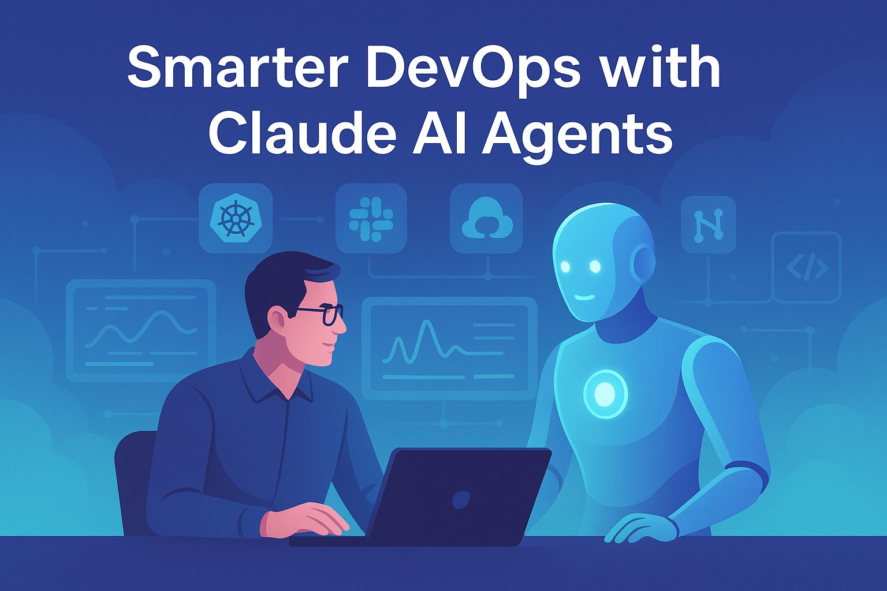
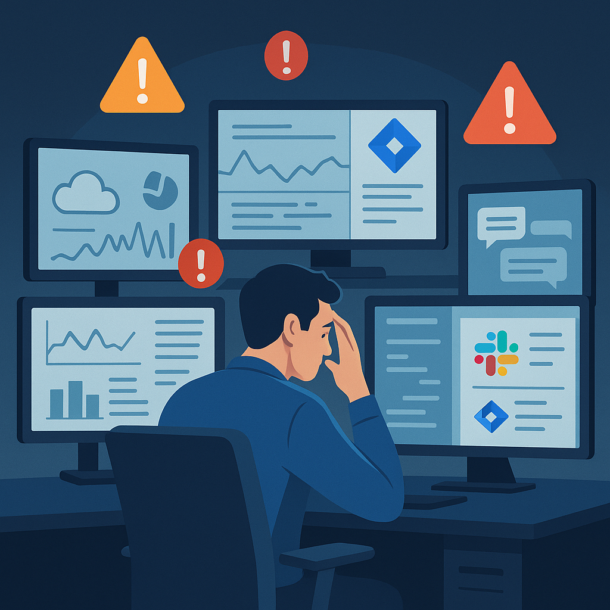
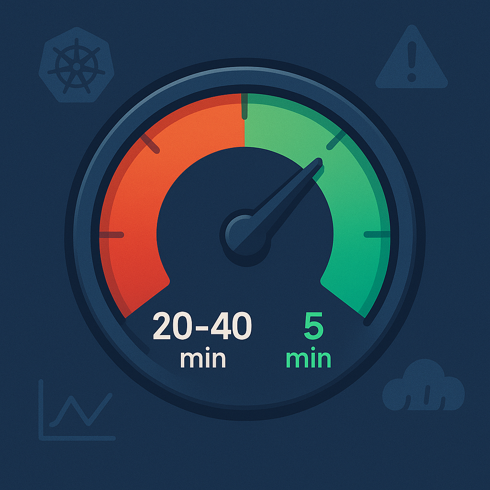
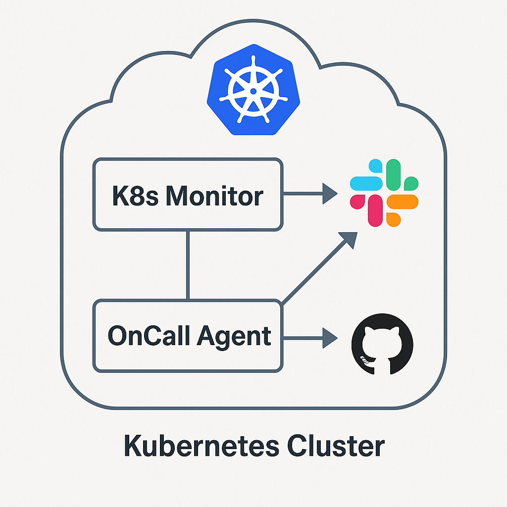
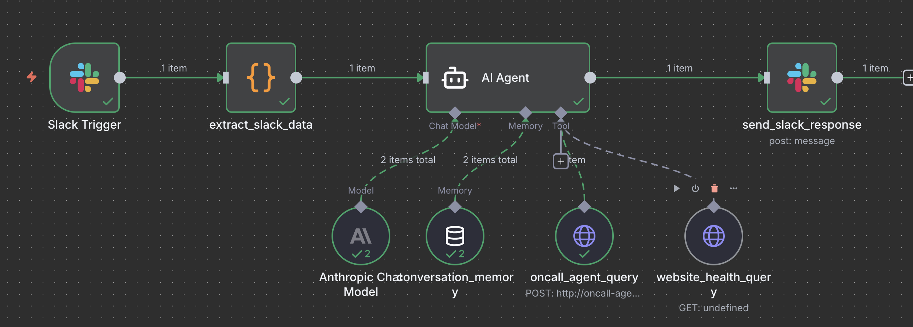
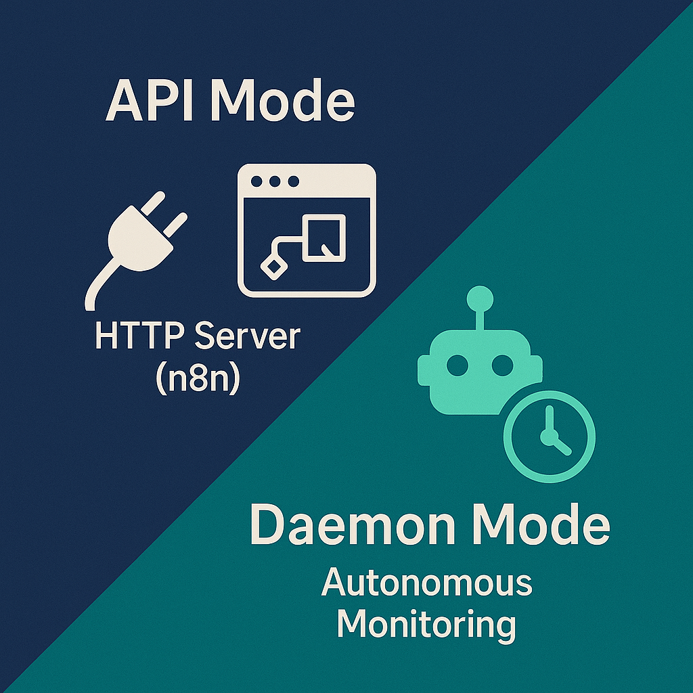

# Smarter DevOps with Claude AI Agents

**Ari Sela**
Senior DevOps Manager at NomiHealth

---

## The Problem We Face Today

🔀 **Multiple Data Sources**
⏱️ **Time-Consuming Correlation**
🚨 **Alert Fatigue**
🔄 **Context Switching**
🧠 **Tribal Knowledge Gap**
❌ **Missed Connections**

---

### Real-World Impact

⏱️ **20-40 minutes Average incident investigation time**

🎯 **Our Goal: Reduce to 2-5 minutes**

---

## Our Solution: Dual AI Agent Architecture

### Two Complementary Approaches

| **K8s Monitor Agent** | **OnCall Agent** |
|----------------------|------------------|
| 🤖 **Proactive** monitoring | 💬 **Interactive** troubleshooting |
| ⏰ Runs every 15 minutes | 🚨 On-demand via Slack |
| 📊 Full cluster scans | 🎯 Targeted investigations |
| 🎫 Creates Jira tickets | 📝 Conversational responses |
| 🔔 Teams notifications | 💡 Context-aware answers |

---

### How They Work Together

---
## K8s Monitor Agent
**Architecture & Tech Stack**
---

### Built on Claude Agent SDK

🧠 **Persistent Memory**
🤝 **Multi-Agent Coordination**
🔌 **MCP Tool Access**
⚙️ **GitOps Configuration**
🛡️ **Safety Hooks**
📂 **`.claude/` Directory**

---

### 6 Specialized Subagents

| Subagent | Purpose |
|----------|---------|
| 🔍 **Diagnostics** | Bulk health checks |
| 🔧 **Remediation** | Safe auto-healing |
| 📝 **Log Analyzer** | Root cause analysis |
| 💰 **Cost Optimizer** | Resource insights |
| 🔗 **GitHub** | Deployment correlation |
| 🎫 **Jira** | Smart ticketing |

---

### MCP Integration

**Structured tool access to:**

☸️ Kubernetes (pods, events, logs)
🔗 GitHub (PRs, deployments)
🎫 Jira (tickets, comments)

---

### Safety First

**Pre-execution validation:**

🛡️ → 📋 → 📢

**Validate → Log → Notify**

**Blocks dangerous operations before execution**

---
## OnCall Agent
**Architecture & Tech Stack**
---

### Built on Anthropic API (Direct)

⚡ **Fast Responses**
🔌 **HTTP API (n8n)**
🎯 **Stateless Design**
📚 **Direct Python Libraries**
💬 **Slack Integration**
🔄 **Two-Turn Investigation**

---

### n8n Orchestration

**Workflow manages the agent:**

**n8n handles:** Memory, tools, coordination

---

### Dual-Mode Operation

---

### K8s Monitor Benefits

🔍 **Proactive Detection**
🤖 **Auto-Correlation**
📚 **Knowledge Preservation**
✅ **Safe Auto-Remediation**

---

### OnCall Agent Benefits

⚡ **Instant Answers**
🔎 **Deep Investigation**
🔌 **Flexible Integration**
📖 **Low Barrier to Entry**

---

## Demo Time!

**Let's see these agents in action**

---

### Demo 1: K8s Monitor Agent

⏰ **Autonomous Monitoring**
📊 **Full Cluster Scan**
🎫 **Jira Ticket Creation**
📢 **Teams Notifications**

---

### Demo 2: OnCall Agent via Slack

💬 **Interactive Chat**
🧠 **Context Memory**
🔍 **Deep Investigation**
📝 **RCA Reports**

---

## What's Next?

### Planned Enhancements

🔧 **Add business logic integration to oncall-agent**

🔗 **Enable k8s-monitor to delegate deep dives to oncall-agent**

🛡️ **Add production protection hooks to k8s-monitor**

📚 **Implement skills in k8s-monitor for better token efficiency**

---

## Resources

### 📦 Source Code

**GitHub Repository:** [github.com/arigsela/claude-agents](https://github.com/arigsela/claude-agents)
- 📁 `k8s-monitor/` - K8s Monitor Agent (Claude Agent SDK)
- 📁 `oncall/` - OnCall Agent (Anthropic API)

### 📚 Documentation

**Claude Agent SDK:** [docs.claude.com/en/api/agent-sdk/overview](https://docs.claude.com/en/api/agent-sdk/overview)

**Claude Client SDKs:** [docs.claude.com/en/api/client-sdks](https://docs.claude.com/en/api/client-sdks)

---

## Questions?

**Thank you!**

