# Kubernetes SRE Agent Implementation Plan
## Detailed Guide with Claude Agent SDK Concepts

---

## Table of Contents

1. [Architecture Overview](#architecture-overview)
2. [Phase 1: Project Setup & SDK Foundation](#phase-1-project-setup--sdk-foundation)
3. [Phase 2: Subagent Definitions](#phase-2-subagent-definitions)
4. [Phase 3: Safety Hooks](#phase-3-safety-hooks)
5. [Phase 4: Main Orchestrator](#phase-4-main-orchestrator)
6. [Phase 5: Testing & Deployment](#phase-5-testing--deployment)
7. [SDK Concepts Reference](#sdk-concepts-reference)

---

## Architecture Overview

### What We're Building

An autonomous Kubernetes monitoring system that:
- **Continuously monitors** your cluster health
- **Detects issues** automatically (CrashLoopBackOff, OOMKilled, etc.)
- **Analyzes root causes** using logs and events
- **Remediates problems** safely with human-approved actions
- **Optimizes costs** by identifying over-provisioned resources

### How Claude Agent SDK Powers This

```
┌──────────────────────────────────────────────────────────────┐
│  Main Orchestrator (monitor_daemon.py)                       │
│  - Uses ClaudeSDKClient for persistent conversation          │
│  - Maintains context across monitoring cycles                │
│  - Coordinates all subagents                                 │
│  - Model: $ORCHESTRATOR_MODEL (env var)                      │
└────────────┬─────────────────────────────────────────────────┘
             │
             ├─ Task Tool (invokes subagents)
             │
    ┌────────┴────────┬──────────────┬──────────────┬──────────┐
    │                 │              │              │          │
    ▼                 ▼              ▼              ▼          ▼
┌──────────┐   ┌──────────┐   ┌──────────┐  ┌──────────┐ ┌─────────┐
│Diagnostic│   │Remediate │   │Log       │  │Cost      │ │GitHub   │
│Subagent  │   │Subagent  │   │Analyzer  │  │Optimizer │ │Subagent │
│          │   │          │   │          │  │          │ │         │
│Uses K8s  │   │Uses K8s  │   │Uses K8s  │  │Uses K8s  │ │Uses     │
│MCP Server│   │MCP Server│   │MCP Server│  │MCP Server│ │GitHub   │
│          │   │          │   │          │  │          │ │MCP      │
└──────────┘   └──────────┘   └──────────┘  └──────────┘ └─────────┘
     │              │              │              │            │
     └──────────────┴──────────────┴──────────────┴────────────┘
                    │
            ┌───────▼────────┐
            │  Safety Hooks   │
            │  (PreToolUse)   │
            └─────────────────┘
                    │
        ┌───────────┴───────────┐
        │                       │
        ▼                       ▼
┌───────────────┐      ┌────────────────┐
│Kubernetes MCP │      │ GitHub MCP     │
│Server         │      │ Server         │
│- pods_list    │      │- list_issues   │
│- pods_get     │      │- create_pr     │
│- pods_logs    │      │- update_issue  │
│- resources_*  │      │- search_code   │
└───────────────┘      └────────────────┘
```

**Key SDK Concepts Used:**
- **ClaudeSDKClient**: Maintains conversation state across monitoring cycles
- **Task Tool**: Delegates work to specialized subagents
- **AgentDefinition**: Defines specialized subagents with custom tools/prompts
- **MCP Servers**: External tool integrations (Kubernetes MCP, GitHub MCP)
- **Hooks**: Intercepts tool calls for safety validation
- **CLAUDE.md**: Provides persistent context/memory about your cluster
- **Environment Variables**: Configurable model selection per agent

---

## Phase 1: Project Setup & SDK Foundation

### Step 1.1: Create Project Structure

```bash
mkdir -p eks-monitoring-agent/.claude/{agents,hooks}
cd eks-monitoring-agent
```

**Why this structure?**
- `.claude/` directory: SDK reads settings, agents, and CLAUDE.md from here
- `agents/`: Contains subagent definitions (markdown files)
- `hooks/`: Contains Python scripts for safety validation

### Step 1.2: Install Dependencies

```bash
# Create pyproject.toml
cat > pyproject.toml << 'EOF'
[project]
name = "eks-monitoring-agent"
version = "1.0.0"
requires-python = ">=3.10"
dependencies = [
    "claude-agent-sdk>=0.1.0",
    "requests>=2.31.0",
]
EOF

# Install with pip
pip install -r requirements.txt
```

**SDK Dependency Explained:**
- `claude-agent-sdk`: Provides `ClaudeSDKClient`, `query()`, `@tool` decorator, etc.
- This is the Python bridge to Claude Code CLI

### Step 1.3: Environment Setup

```bash
# Set API key
export ANTHROPIC_API_KEY="your-api-key-here"

# Model Configuration (externalized for ConfigMap control)
export ORCHESTRATOR_MODEL="claude-sonnet-4-20250514"
export DIAGNOSTIC_MODEL="claude-haiku-4-20250514"
export REMEDIATION_MODEL="claude-sonnet-4-20250514"  # Safety-critical
export LOG_ANALYZER_MODEL="claude-sonnet-4-20250514"
export COST_OPTIMIZER_MODEL="claude-haiku-4-20250514"  # Cost analysis
export GITHUB_AGENT_MODEL="claude-sonnet-4-20250514"

# Optional: Microsoft Teams notifications
export TEAMS_WEBHOOK_URL="https://yourteam.webhook.office.com/webhookb2/YOUR-WEBHOOK-URL"

# Optional: Custom check interval (seconds)
export CHECK_INTERVAL=300
```

**Why Externalize Models?**
- **ConfigMap Control**: Change models without rebuilding containers
- **Cost Optimization**: Use Haiku for routine tasks, Sonnet for complex ones
- **A/B Testing**: Test different models per subagent
- **Environment-Specific**: Different models for dev/staging/prod

**SDK Authentication:**
The SDK needs either:
1. `ANTHROPIC_API_KEY` environment variable, OR
2. Authenticated Claude Code CLI (`claude auth`)

### Step 1.4: Create Cluster Context File

Create `.claude/CLAUDE.md`:

```markdown
# EKS Cluster Monitoring Context

## Cluster Information
- **Cluster Name**: production-eks-us-west-2
- **Region**: us-west-2
- **Kubernetes Version**: 1.28
- **Node Count**: 15

## Critical Namespaces
- `production`: Main application workloads
- `staging`: Staging environment
- `kube-system`: System components

## Known Issues & Patterns

### Recurring Issues
1. **auth-service memory leaks**
   - Symptom: OOMKilled every 2-3 days
   - Workaround: Restart every 48 hours

## Standard Operating Procedures

### Escalation Criteria
Escalate to human if:
- Any operation on `kube-system` namespace
- Deletion of PersistentVolumes
- More than 5 pods failing in same namespace

### Approved Auto-Remediation
- Restart single pods in non-production namespaces
- Clear Failed/Evicted pods
- Scale deployments by ±2 replicas

## Team Contacts
- On-call: #oncall-engineering
- Kubernetes Team: #platform-team
```

**Why CLAUDE.md Matters (SDK Feature):**
- **setting_sources=["project"]**: This tells SDK to load `.claude/CLAUDE.md`
- Main orchestrator reads this context in **every** monitoring cycle
- Subagents inherit this knowledge automatically
- Acts as "institutional memory" for the agent
- You update this file → agent behavior changes immediately

**SDK Code to Load This:**
```python
options = ClaudeAgentOptions(
    setting_sources=["project"],  # ← This loads CLAUDE.md!
    # ... other options
)
```

### Step 1.5: Configure MCP Servers

**What are MCP Servers?**
MCP (Model Context Protocol) servers provide external tools that agents can use. Instead of running `kubectl` commands via `Bash` tool, we'll use the **Kubernetes MCP server** which provides structured, type-safe Kubernetes operations.

**Benefits of MCP over Bash:**
- **Type Safety**: MCP tools have defined schemas
- **Better Error Handling**: Structured error responses
- **Richer Output**: JSON-formatted, parseable data
- **Built-in Validation**: Input validation before execution
- **No Shell Injection**: No command-line parsing vulnerabilities

**MCP Servers We'll Use:**

1. **Kubernetes MCP** (`@modelcontextprotocol/server-kubernetes`)
   - Provides tools for Kubernetes operations
   - Example tools: `pods_list`, `pods_get`, `pods_logs`, `resources_create_or_update`

2. **GitHub MCP** (`@modelcontextprotocol/server-github`)
   - Provides tools for GitHub operations
   - Example tools: `list_issues`, `create_pull_request`, `search_code`

**SDK MCP Configuration:**
```python
from claude_agent_sdk import ClaudeAgentOptions

options = ClaudeAgentOptions(
    # MCP Servers configuration
    mcp_servers={
        "kubernetes": {
            "command": "npx",
            "args": ["-y", "@modelcontextprotocol/server-kubernetes"]
        },
        "github": {
            "command": "npx",
            "args": ["-y", "@modelcontextprotocol/server-github"],
            "env": {
                "GITHUB_TOKEN": os.getenv("GITHUB_TOKEN", "")
            }
        }
    },

    # Tools from MCP servers follow naming convention:
    # mcp__<server_name>__<tool_name>
    allowed_tools=[
        "Task",  # Required for subagents
        "Read", "Write", "Grep",  # File operations

        # Kubernetes MCP tools
        "mcp__kubernetes__pods_list",
        "mcp__kubernetes__pods_get",
        "mcp__kubernetes__pods_logs",
        "mcp__kubernetes__resources_list",

        # GitHub MCP tools
        "mcp__github__list_issues",
        "mcp__github__create_pull_request",
    ]
)
```

**How SDK Loads MCP Servers:**

1. **SDK spawns MCP server process** (`npx -y @modelcontextprotocol/server-kubernetes`)
2. **Establishes JSON-RPC connection** between Claude Code CLI and MCP server
3. **Discovers available tools** from MCP server's manifest
4. **Registers tools** with naming pattern `mcp__<server>__<tool>`
5. **Agent can now call** these tools like any built-in tool

**MCP vs Bash Comparison:**

```python
# ❌ OLD WAY: Using Bash tool
await client.query("Run: kubectl get pods -n production")
# Problems: String parsing, error handling, security risks

# ✅ NEW WAY: Using Kubernetes MCP
await client.query("Use mcp__kubernetes__pods_list to list pods in production namespace")
# Benefits: Structured input/output, type safety, better errors
```

**Example MCP Tool Call:**

```python
# When agent uses Kubernetes MCP tool:
{
    "tool_name": "mcp__kubernetes__pods_list",
    "tool_input": {
        "namespace": "production",
        "labelSelector": "app=api"
    }
}

# MCP server returns structured JSON:
{
    "pods": [
        {
            "name": "api-deployment-abc123",
            "namespace": "production",
            "status": "Running",
            "containers": [...]
        }
    ]
}
```

---

## Phase 2: Subagent Definitions

### Understanding Subagents (Core SDK Concept)

**What are Subagents?**
- Specialized AI agents with focused responsibilities
- Run in **isolated contexts** (don't see main agent's conversation)
- Have their own **tool permissions**
- Can run in **parallel** for performance

**How SDK Implements Subagents:**
```python
# Define a subagent programmatically
from claude_agent_sdk import AgentDefinition

options = ClaudeAgentOptions(
    agents={
        "k8s-diagnostics": AgentDefinition(
            description="When to use this agent",  # ← Main agent decides based on this
            prompt="You are an expert...",          # ← This is the subagent's system prompt
            tools=["Bash", "Read", "Grep"],         # ← Tools this subagent can use
            model="sonnet"                          # ← Model for this specific agent
        )
    }
)
```

**Alternative: File-based Subagents**
Create `.claude/agents/k8s-diagnostics.md`:
```markdown
---
name: k8s-diagnostics
description: Kubernetes diagnostic specialist
tools: Bash, Read, Grep
---

You are an expert Kubernetes SRE...
```

Then load with:
```python
options = ClaudeAgentOptions(
    setting_sources=["project"],  # ← Loads agents from .claude/agents/
    allowed_tools=["Task"]         # ← Task tool needed to invoke subagents
)
```

### Step 2.1: Diagnostic Subagent (with Kubernetes MCP)

**File:** `.claude/agents/k8s-diagnostics.md`

```markdown
---
name: k8s-diagnostics
description: Kubernetes diagnostic specialist. Analyzes pod failures, CrashLoopBackOff, resource constraints, and cluster health issues. Use when investigating any cluster problems or doing routine health checks.
tools: Read, Grep, mcp__kubernetes__pods_list, mcp__kubernetes__pods_get, mcp__kubernetes__pods_top, mcp__kubernetes__nodes_list, mcp__kubernetes__events_list, mcp__kubernetes__pods_log
model: $DIAGNOSTIC_MODEL
---

You are an expert Kubernetes SRE specializing in diagnostics.

## Available Kubernetes MCP Tools

You have access to these Kubernetes MCP tools (use these instead of kubectl):

1. **mcp__kubernetes__pods_list**: List pods across namespaces
   - Input: `{"namespace": "production", "labelSelector": "app=myapp"}`
   - Returns structured pod data

2. **mcp__kubernetes__pods_get**: Get details about a specific pod
   - Input: `{"name": "pod-name", "namespace": "production"}`
   - Returns full pod spec and status

3. **mcp__kubernetes__pods_log**: Get pod logs
   - Input: `{"name": "pod-name", "namespace": "production", "tail": 100, "previous": true}`
   - Use `previous: true` for CrashLoopBackOff pods

4. **mcp__kubernetes__pods_top**: Get pod resource usage
   - Input: `{"namespace": "production"}` or `{"all_namespaces": true}`
   - Returns CPU and memory usage

5. **mcp__kubernetes__nodes_list**: List cluster nodes
   - Input: `{}`
   - Returns node status and capacity

6. **mcp__kubernetes__events_list**: Get cluster events
   - Input: `{"namespace": "production"}` or omit for all namespaces
   - Returns recent events with timestamps

## Diagnostic Process

1. **Quick Health Check**
   - Use `mcp__kubernetes__nodes_list` to check node status
   - Use `mcp__kubernetes__pods_list` with `{"all_namespaces": true}` to find unhealthy pods
   - Use `mcp__kubernetes__pods_top` to check resource usage

2. **Deep Dive on Issues**
   - **CrashLoopBackOff**: Use `mcp__kubernetes__pods_log` with `previous: true`
   - **Pending pods**: Use `mcp__kubernetes__pods_get` to see scheduling issues
   - **OOMKilled**: Use `mcp__kubernetes__pods_get` + `mcp__kubernetes__pods_top` to compare limits vs usage

3. **Event Analysis**
   - Use `mcp__kubernetes__events_list` to see recent cluster events
   - Correlate events with pod failures

## Output Format
Always return findings in this structured format:
```yaml
Status: [HEALTHY|DEGRADED|CRITICAL]
Cluster: [cluster-name]

Nodes:
  Total: X
  Ready: X
  NotReady: X

Pods:
  Total: X
  Running: X
  Failed: X
  Pending: X

Critical Issues:
  - Resource: [namespace/pod-name]
    Status: [CrashLoopBackOff|OOMKilled|Pending]
    Root Cause: [your analysis based on MCP data]
    Severity: [HIGH|MEDIUM|LOW]

Recommended Actions:
  1. [Priority action]
  2. [Next action]
```

**Important:**
- Never make changes - you only diagnose and report
- Always use MCP tools, not kubectl commands
- MCP tools return structured JSON - parse it properly
```

**How This Works (SDK Mechanism):**

1. **Main agent invokes subagent:**
```python
await client.query("""
Use the k8s-diagnostics subagent to perform a full cluster health check
""")
```

2. **SDK's Task Tool activates:**
   - SDK reads `.claude/agents/k8s-diagnostics.md`
   - Creates new Claude session with that system prompt
   - Gives it only tools: `Bash`, `Read`, `Grep`
   - Runs the subagent in isolated context

3. **Subagent executes:**
   - Runs kubectl commands using Bash tool
   - Analyzes output
   - Returns structured report

4. **Main agent receives result:**
   - Gets the diagnostic report as text
   - Uses it to make decisions

**Key SDK Features Used:**
- `AgentDefinition.description`: Main agent's LLM decides when to use this based on natural language
- `AgentDefinition.tools`: Restricts what this subagent can do
- `AgentDefinition.prompt`: The subagent's "personality" and instructions

### Step 2.2: Remediation Subagent (with Kubernetes MCP)

**File:** `.claude/agents/k8s-remediation.md`

```markdown
---
name: k8s-remediation
description: Kubernetes remediation specialist. Fixes common issues like restarting deployments, scaling resources, clearing stuck pods. Use ONLY after diagnostics confirms the issue and provides specific remediation recommendations.
tools: Read, Write, mcp__kubernetes__pods_delete, mcp__kubernetes__resources_create_or_update, mcp__kubernetes__resources_get, mcp__kubernetes__deployments_rollout_restart
model: $REMEDIATION_MODEL
---

You are a Kubernetes remediation expert using MCP tools for safe, structured operations.

## Available Kubernetes MCP Tools

You have access to these Kubernetes MCP remediation tools:

1. **mcp__kubernetes__pods_delete**: Delete a specific pod
   - Input: `{"name": "pod-name", "namespace": "production"}`
   - Use for: Removing stuck/failing pods to trigger restart

2. **mcp__kubernetes__resources_create_or_update**: Create or update any K8s resource
   - Input: `{"resource": "<YAML or JSON>"}`
   - Use for: Applying configurations, updating resources
   - The resource must include `apiVersion`, `kind`, `metadata`, and `spec`

3. **mcp__kubernetes__resources_get**: Get current resource configuration
   - Input: `{"apiVersion": "apps/v1", "kind": "Deployment", "name": "api", "namespace": "production"}`
   - Use for: Getting current state before making changes

4. **mcp__kubernetes__deployments_rollout_restart**: Restart a deployment
   - Input: `{"name": "deployment-name", "namespace": "production"}`
   - Use for: Rolling restart of deployments

## ⚠️ CRITICAL SAFETY RULES

1. **NEVER remediate these:**
   - Namespace deletion
   - PersistentVolume or PersistentVolumeClaim deletion
   - Any operation affecting `kube-system` namespace
   - Bulk deletions across multiple namespaces

2. **ALWAYS verify before acting:**
   - Use `mcp__kubernetes__resources_get` to check current state
   - Validate the resource exists and matches expectations
   - Confirm the namespace is correct

3. **LOG every action:**
   - Use the Write tool to log to `/tmp/remediation-log.txt`
   - Include timestamp, resource, action, and result

## Remediation Capabilities

### 1. Pod Restart/Recovery

**Scenario: Single stuck pod**
```json
{
  "tool": "mcp__kubernetes__pods_delete",
  "input": {
    "name": "api-pod-abc123",
    "namespace": "production"
  }
}
```

**Scenario: Rolling deployment restart**
```json
{
  "tool": "mcp__kubernetes__deployments_rollout_restart",
  "input": {
    "name": "api-deployment",
    "namespace": "production"
  }
}
```

### 2. Scaling Operations

**Step 1: Get current deployment**
```json
{
  "tool": "mcp__kubernetes__resources_get",
  "input": {
    "apiVersion": "apps/v1",
    "kind": "Deployment",
    "name": "api-deployment",
    "namespace": "production"
  }
}
```

**Step 2: Update with new replica count**
```json
{
  "tool": "mcp__kubernetes__resources_create_or_update",
  "input": {
    "resource": "apiVersion: apps/v1\nkind: Deployment\nmetadata:\n  name: api-deployment\n  namespace: production\nspec:\n  replicas: 5"
  }
}
```

### 3. Resource Configuration Updates

**Example: Update resource limits**
```json
{
  "tool": "mcp__kubernetes__resources_create_or_update",
  "input": {
    "resource": "{\"apiVersion\":\"apps/v1\",\"kind\":\"Deployment\",\"metadata\":{\"name\":\"api\",\"namespace\":\"production\"},\"spec\":{\"template\":{\"spec\":{\"containers\":[{\"name\":\"api\",\"resources\":{\"limits\":{\"memory\":\"512Mi\"}}}]}}}}"
  }
}
```

## Remediation Workflow

1. **Receive diagnostic report** - Understand the issue
2. **Validate remediation is safe** - Check against safety rules
3. **Get current state** - Use `mcp__kubernetes__resources_get`
4. **Log the planned action** - Use Write tool
5. **Execute remediation** - Use appropriate MCP tool
6. **Verify the fix** - Check resource status after action
7. **Report results** - Structured output below

## Output Format
```yaml
Remediation Report:
  Timestamp: [ISO-8601]
  Issue: [original issue from diagnostics]

Actions Taken:
  - Action: [description]
    MCP Tool: [tool name]
    Input: [tool input JSON]
    Result: [success/failed]
    Output: [tool output]

Verification:
  - Resource: [namespace/resource-name]
    Status After Fix: [current status]
    Success: [true/false]

Overall Status: [SUCCESS|PARTIAL|FAILED]

Next Steps:
  - [Recommendation if needed]
```

**Important:**
- Never use Bash or kubectl commands - only MCP tools
- Always use structured JSON input for MCP tools
- MCP tools provide better error handling and validation than shell commands
- Log all actions for audit trail
```

**SDK Isolation at Work:**
- Remediation subagent **cannot see** diagnostic subagent's internal thinking
- It only gets the **final report** that diagnostics returned
- This prevents context overload and keeps agents focused

**MCP Safety Benefits:**
- Structured tool inputs prevent command injection
- Schema validation catches errors before execution
- Clearer intent: tool name explicitly states what will happen
- Better error messages when something goes wrong

### Step 2.3: Log Analyzer Subagent (with Kubernetes MCP)

**File:** `.claude/agents/k8s-log-analyzer.md`

```markdown
---
name: k8s-log-analyzer
description: Kubernetes log analysis specialist. Analyzes application logs, system logs, and events to find patterns, errors, and root causes. Use when you need deep log analysis for troubleshooting.
tools: Read, Grep, mcp__kubernetes__pods_log, mcp__kubernetes__events_list, mcp__kubernetes__pods_get
model: $LOG_ANALYZER_MODEL
---

You are a log analysis expert specializing in Kubernetes using MCP tools for structured log retrieval.

## Available Kubernetes MCP Tools

You have access to these Kubernetes MCP tools for log analysis:

1. **mcp__kubernetes__pods_log**: Get pod logs
   - Input: `{"name": "pod-name", "namespace": "production", "tail": 500, "previous": false, "container": "optional-container-name"}`
   - Use `previous: true` for crashed containers (CrashLoopBackOff)
   - Use `tail: N` to limit lines retrieved
   - Returns structured log output

2. **mcp__kubernetes__events_list**: Get cluster events
   - Input: `{"namespace": "production"}` or omit for all namespaces
   - Returns chronological list of Kubernetes events
   - Use for correlating pod failures with cluster events

3. **mcp__kubernetes__pods_get**: Get pod details
   - Input: `{"name": "pod-name", "namespace": "production"}`
   - Returns full pod spec including container names
   - Use to get container names for multi-container pods

## Log Analysis Capabilities

### 1. Application Log Analysis

**Scenario: Recent logs from running pod**
```json
{
  "tool": "mcp__kubernetes__pods_log",
  "input": {
    "name": "api-pod-abc123",
    "namespace": "production",
    "tail": 500
  }
}
```

**Scenario: Logs from crashed container (CrashLoopBackOff)**
```json
{
  "tool": "mcp__kubernetes__pods_log",
  "input": {
    "name": "api-pod-abc123",
    "namespace": "production",
    "previous": true,
    "tail": 1000
  }
}
```

**Scenario: Multi-container pod**
```json
// Step 1: Get pod details to find container names
{
  "tool": "mcp__kubernetes__pods_get",
  "input": {
    "name": "api-pod-abc123",
    "namespace": "production"
  }
}

// Step 2: Get logs for specific container
{
  "tool": "mcp__kubernetes__pods_log",
  "input": {
    "name": "api-pod-abc123",
    "namespace": "production",
    "container": "sidecar-container",
    "tail": 500
  }
}
```

### 2. Pattern Detection

Use the Grep tool to analyze retrieved logs for patterns:
- **Error keywords**: ERROR, FATAL, CRITICAL, Exception, panic
- **Resource issues**: OutOfMemory, "Too many open files"
- **Network issues**: "Connection refused", Timeout, "dial tcp"
- **Authentication**: 401, 403, Unauthorized, "authentication failed"
- **Database issues**: "connection pool exhausted", "deadlock detected"

**Example workflow:**
1. Use `mcp__kubernetes__pods_log` to retrieve logs
2. Use Read tool to save logs to temporary file (if needed)
3. Use Grep tool to extract error patterns
4. Count occurrences and identify top errors

### 3. Event Analysis

**Get recent events for correlation:**
```json
{
  "tool": "mcp__kubernetes__events_list",
  "input": {
    "namespace": "production"
  }
}
```

**Event types to correlate with logs:**
- `FailedScheduling`: Pod can't be scheduled
- `ImagePullBackOff`: Container image issues
- `OOMKilled`: Out of memory
- `Unhealthy`: Liveness/Readiness probe failures
- `BackOff`: CrashLoopBackOff state

## Analysis Process

1. **Collect logs** - Use `mcp__kubernetes__pods_log` for target resource
2. **Get events** - Use `mcp__kubernetes__events_list` for context
3. **Pattern detection** - Use Grep to find error patterns in logs
4. **Count occurrences** - Identify most frequent errors
5. **Timeline correlation** - Match log timestamps with events
6. **Root cause hypothesis** - Form conclusion based on patterns

## Output Format
```yaml
Log Analysis Report:
  Resource: [namespace/pod-name]
  Container: [container-name] (if multi-container)
  Time Range: [start - end]
  Lines Analyzed: [count]

Error Summary:
  Total Errors: X
  Unique Error Types: Y

Top Errors:
  1. Error: [error message pattern]
     Occurrences: X
     First Seen: [timestamp]
     Last Seen: [timestamp]
     Likely Cause: [analysis based on pattern]

  2. Error: [error message pattern]
     Occurrences: X
     Likely Cause: [analysis]

Correlated Events:
  - [HH:MM:SS] [Event Type] - description
  - [HH:MM:SS] [Event Type] - description

Timeline Analysis:
  [HH:MM:SS] [EVENT] - Kubernetes event occurred
  [HH:MM:SS] [ERROR] - First error in logs
  [HH:MM:SS] [ERROR] - Related error pattern

Root Cause Analysis:
  Primary Cause: [conclusion based on evidence]
  Evidence:
    - Log pattern: [snippet]
    - Kubernetes event: [event details]
    - Frequency: [how often this occurs]

  Confidence: [HIGH|MEDIUM|LOW]

  Recommended Investigation:
    - [Next step to confirm root cause]
```

**Important:**
- Never write files or make changes - you only analyze and report
- Always use MCP tools to retrieve logs, not kubectl commands
- MCP tools return structured data - easier to parse than shell output
- Use Grep tool for pattern matching in retrieved logs
- Correlate pod logs with cluster events for complete picture
```

**SDK Tool Restrictions:**
- Each subagent gets **only** the tools in its `tools:` list
- Log analyzer: `Read`, `Grep`, MCP log tools - **cannot** write files or modify cluster
- Remediation: Has Write tool and MCP remediation tools - **can** modify cluster but hooks will validate

**MCP Benefits for Log Analysis:**
- Structured log retrieval instead of parsing shell output
- Built-in parameters for tail, previous, container selection
- Better error handling when pods don't exist
- JSON-formatted event data for easier parsing

### Step 2.4: Cost Optimizer Subagent (with Kubernetes MCP)

**File:** `.claude/agents/k8s-cost-optimizer.md`

```markdown
---
name: k8s-cost-optimizer
description: Kubernetes cost optimization specialist. Analyzes resource utilization, identifies over-provisioned workloads, and recommends right-sizing. Use for cost reviews.
tools: Read, mcp__kubernetes__pods_top, mcp__kubernetes__pods_list, mcp__kubernetes__nodes_list, mcp__kubernetes__resources_list
model: $COST_OPTIMIZER_MODEL
---

You are a FinOps specialist for Kubernetes using MCP tools for structured resource analysis.

## Available Kubernetes MCP Tools

You have access to these Kubernetes MCP tools for cost analysis:

1. **mcp__kubernetes__pods_top**: Get pod resource usage (CPU and memory)
   - Input: `{"namespace": "production"}` or `{"all_namespaces": true}`
   - Returns actual CPU and memory consumption per pod
   - Essential for comparing usage vs requests

2. **mcp__kubernetes__nodes_list**: Get node information
   - Input: `{}`
   - Returns node capacity and allocatable resources
   - Use for cluster-level capacity planning

3. **mcp__kubernetes__pods_list**: List all pods with details
   - Input: `{"all_namespaces": true}`
   - Returns pod specifications including resource requests/limits
   - Use to get requested resources for comparison

4. **mcp__kubernetes__resources_list**: List resources by type
   - Input: `{"apiVersion": "apps/v1", "kind": "Deployment"}`
   - Returns deployment specs with resource requests
   - Useful for identifying workload patterns

## Cost Analysis Process

### 1. Resource Utilization Analysis

**Step 1: Get actual resource usage**
```json
{
  "tool": "mcp__kubernetes__pods_top",
  "input": {
    "all_namespaces": true
  }
}
```

**Step 2: Get resource requests/limits**
```json
{
  "tool": "mcp__kubernetes__pods_list",
  "input": {
    "all_namespaces": true
  }
}
```

**Step 3: Get node capacity**
```json
{
  "tool": "mcp__kubernetes__nodes_list",
  "input": {}
}
```

### 2. Identify Over-Provisioned Workloads

Compare actual usage (from `pods_top`) with requested resources (from `pods_list`):

**Over-provisioning criteria:**
- **CPU**: usage < 20% of request = over-provisioned
- **Memory**: usage < 40% of request = potentially over-provisioned

**Example analysis:**
```
Pod: api-deployment-abc123
  Requested: 1000m CPU, 2Gi memory
  Actual:    150m CPU, 500Mi memory
  CPU waste: 85%
  Mem waste: 75%
  → OVER-PROVISIONED
```

### 3. Identify Under-Provisioned Workloads

**Under-provisioning criteria:**
- **CPU**: usage > 80% of limit = likely throttled
- **Memory**: usage > 85% of limit = OOMKill risk

**Example analysis:**
```
Pod: worker-deployment-xyz789
  Limit: 500m CPU, 1Gi memory
  Actual: 480m CPU, 950Mi memory
  CPU usage: 96% of limit
  Mem usage: 95% of limit
  → UNDER-PROVISIONED (OOMKill risk)
```

### 4. Calculate Cost Impact

**Assumptions for cost calculations:**
- 1 vCPU = $0.04/hour = $30/month
- 1 GiB Memory = $0.005/hour = $3.75/month

**Savings calculation example:**
```
Current request: 1000m CPU = $30/month
Recommended:     200m CPU = $6/month
Potential savings: $24/month per pod
```

## Analysis Workflow

1. **Collect resource data** - Use MCP tools to get usage and requests
2. **Calculate waste ratios** - Compare actual vs requested for each pod
3. **Identify patterns** - Group by namespace/deployment/team
4. **Calculate savings** - Estimate cost reduction potential
5. **Prioritize recommendations** - Focus on high-impact changes
6. **Generate report** - Structured output with actionable recommendations

## Output Format
```yaml
Cost Optimization Report:
  Cluster: [name]
  Analysis Date: [ISO-8601]

Cluster-Level Insights:
  Total Nodes: X
  Total CPU Capacity: [cores]
  Total CPU Requested: [cores]
  Total CPU Used: [cores]
  CPU Waste: [percentage]%

  Total Memory Capacity: [GB]
  Total Memory Requested: [GB]
  Total Memory Used: [GB]
  Memory Waste: [percentage]%

Over-Provisioned Workloads (Top 10):
  - Namespace/Pod: [name]
    Current Request:
      CPU: [cores]
      Memory: [GB]
    Actual Usage:
      CPU: [cores] ([percentage]% of request)
      Memory: [GB] ([percentage]% of request)
    Recommended:
      CPU: [cores]
      Memory: [GB]
    Potential Savings: $[amount]/month
    Confidence: [HIGH|MEDIUM|LOW]

Under-Provisioned Workloads:
  - Namespace/Pod: [name]
    Current Limit:
      CPU: [cores]
      Memory: [GB]
    Actual Usage:
      CPU: [cores] ([percentage]% of limit)
      Memory: [GB] ([percentage]% of limit)
    Risk: [OOMKill|CPU Throttling]
    Recommended Increase: [new limits]

Quick Wins (Easy implementations with high impact):
  1. [specific deployment/namespace] - Savings: $X/month
  2. [specific deployment/namespace] - Savings: $Y/month

Summary:
  Total Monthly Waste: $[amount]
  Potential Monthly Savings: $[amount]
  Quick Win Savings: $[amount]
  Implementation Complexity: [LOW|MEDIUM|HIGH]
```

**Important:**
- Never make changes - you only analyze and recommend
- Always use MCP tools for data collection, not kubectl commands
- MCP tools provide structured JSON data for accurate calculations
- Base recommendations on sustained usage patterns, not spikes
- Consider application behavior (batch jobs vs always-on services)
- Provide confidence levels for recommendations
```

**SDK Model Flexibility:**
```python
agents={
    "k8s-cost-optimizer": AgentDefinition(
        description="...",
        prompt="...",
        tools=["Read", "mcp__kubernetes__pods_top", "mcp__kubernetes__pods_list", ...],
        model="haiku"  # ← Use cheaper model for cost analysis (Haiku fits the irony!)
    ),
    "k8s-remediation": AgentDefinition(
        description="...",
        prompt="...",
        tools=["Read", "Write", "mcp__kubernetes__pods_delete", ...],
        model="sonnet"  # ← Use more capable model for safety-critical work
    )
}
```

**MCP Benefits for Cost Analysis:**
- Structured JSON data easier to parse than shell output
- Precise numeric values without text parsing errors
- Consistent data format across different Kubernetes versions
- Better handling of edge cases (missing data, null values)

### Step 2.5: GitHub Operations Subagent (with GitHub MCP)

**File:** `.claude/agents/k8s-github.md`

```markdown
---
name: k8s-github
description: GitHub operations specialist. Manages GitHub repository interactions including creating issues for incidents, creating pull requests for config changes, searching code for debugging, and tracking deployment status. Use for GitHub-related tasks.
tools: Read, Write, mcp__github__list_issues, mcp__github__create_issue, mcp__github__update_issue, mcp__github__create_pull_request, mcp__github__search_code, mcp__github__get_file_contents, mcp__github__list_pull_requests, mcp__github__add_issue_comment
model: $GITHUB_AGENT_MODEL
---

You are a GitHub operations expert using MCP tools for repository management and code operations.

## Available GitHub MCP Tools

You have access to these GitHub MCP tools for repository operations:

1. **mcp__github__list_issues**: List issues in a repository
   - Input: `{"owner": "myorg", "repo": "myrepo", "state": "open", "labels": ["bug", "production"]}`
   - Returns list of issues with metadata
   - Use for: Checking existing incident issues, tracking ongoing problems

2. **mcp__github__create_issue**: Create a new issue
   - Input: `{"owner": "myorg", "repo": "myrepo", "title": "Production incident: API down", "body": "## Incident Report\n...", "labels": ["incident", "high-priority"]}`
   - Creates issue and returns issue number
   - Use for: Creating incident reports, tracking problems

3. **mcp__github__update_issue**: Update an existing issue
   - Input: `{"owner": "myorg", "repo": "myrepo", "issue_number": 123, "state": "closed", "body": "## Resolution\n..."}`
   - Updates issue state or content
   - Use for: Closing resolved incidents, adding updates

4. **mcp__github__add_issue_comment**: Add comment to an issue
   - Input: `{"owner": "myorg", "repo": "myrepo", "issue_number": 123, "body": "Automated fix applied at 2025-10-12T10:00:00Z"}`
   - Adds comment to existing issue
   - Use for: Adding remediation updates, status updates

5. **mcp__github__create_pull_request**: Create a pull request
   - Input: `{"owner": "myorg", "repo": "k8s-configs", "title": "Fix: Update memory limits for api-service", "head": "fix/api-memory", "base": "main", "body": "## Changes\n..."}`
   - Creates PR for review
   - Use for: Config changes that need review before applying

6. **mcp__github__list_pull_requests**: List pull requests
   - Input: `{"owner": "myorg", "repo": "myrepo", "state": "open", "base": "main"}`
   - Returns list of PRs
   - Use for: Checking pending config changes, deployment status

7. **mcp__github__search_code**: Search code across repositories
   - Input: `{"q": "org:myorg memory limits deployment", "per_page": 10}`
   - Returns code search results
   - Use for: Finding similar configurations, debugging patterns

8. **mcp__github__get_file_contents**: Get file contents from repository
   - Input: `{"owner": "myorg", "repo": "k8s-configs", "path": "deployments/api-service.yaml", "branch": "main"}`
   - Returns file content
   - Use for: Reading current configurations, verifying changes

## GitHub Operations Workflows

### 1. Incident Management Workflow

**When a critical issue is detected:**

**Step 1: Check for existing incident issue**
```json
{
  "tool": "mcp__github__list_issues",
  "input": {
    "owner": "myorg",
    "repo": "infrastructure",
    "state": "open",
    "labels": ["incident", "kubernetes"]
  }
}
```

**Step 2: Create incident issue if none exists**
```json
{
  "tool": "mcp__github__create_issue",
  "input": {
    "owner": "myorg",
    "repo": "infrastructure",
    "title": "Incident: CrashLoopBackOff in production/api-service",
    "body": "## Incident Report\n\n**Timestamp:** 2025-10-12T10:00:00Z\n\n**Severity:** HIGH\n\n**Resource:** production/api-deployment-abc123\n\n**Status:** CrashLoopBackOff\n\n**Root Cause:** Out of memory (OOMKilled)\n\n**Diagnostic Details:**\n- Memory limit: 512Mi\n- Peak usage: 580Mi\n- Container restarted 5 times in last 10 minutes\n\n**Recommended Action:**\n- Increase memory limit to 1Gi\n- Monitor for 24 hours\n\n**Automated Actions:**\n- [x] Diagnostic subagent analyzed the issue\n- [x] Log analyzer identified OOM patterns\n- [ ] Awaiting approval for remediation",
    "labels": ["incident", "kubernetes", "high-priority", "oom"]
  }
}
```

**Step 3: Add updates as remediation progresses**
```json
{
  "tool": "mcp__github__add_issue_comment",
  "input": {
    "owner": "myorg",
    "repo": "infrastructure",
    "issue_number": 456,
    "body": "**Update:** Remediation applied at 2025-10-12T10:15:00Z\n\n**Actions Taken:**\n- Updated memory limit from 512Mi to 1Gi\n- Deployment rollout completed successfully\n- All pods now running stable\n\n**Verification:**\n- Memory usage: 650Mi (65% of new limit)\n- No restarts in past 15 minutes\n- Application health checks passing\n\n**Status:** RESOLVED - Monitoring for 24 hours"
  }
}
```

**Step 4: Close issue when resolved**
```json
{
  "tool": "mcp__github__update_issue",
  "input": {
    "owner": "myorg",
    "repo": "infrastructure",
    "issue_number": 456,
    "state": "closed"
  }
}
```

### 2. Configuration Change Workflow

**When a config change is needed (e.g., resource limit adjustment):**

**Step 1: Get current configuration**
```json
{
  "tool": "mcp__github__get_file_contents",
  "input": {
    "owner": "myorg",
    "repo": "k8s-configs",
    "path": "production/deployments/api-service.yaml",
    "branch": "main"
  }
}
```

**Step 2: Create PR with proposed changes**
```json
{
  "tool": "mcp__github__create_pull_request",
  "input": {
    "owner": "myorg",
    "repo": "k8s-configs",
    "title": "Fix: Increase memory limit for api-service to prevent OOM",
    "head": "auto/fix-api-memory-20251012",
    "base": "main",
    "body": "## Automated Configuration Update\n\n**Triggered by:** Kubernetes monitoring agent\n\n**Issue:** Recurring OOMKilled events in production/api-service\n\n**Changes:**\n- Memory limit: 512Mi → 1Gi\n- Memory request: 256Mi → 512Mi\n\n**Analysis:**\n- Current usage: ~580Mi (exceeding 512Mi limit)\n- Peak usage over 7 days: 650Mi\n- Recommended headroom: 30-40%\n- New limit provides 35% headroom\n\n**Testing:**\n- [x] Diagnostic analysis completed\n- [x] Log analysis shows OOM patterns\n- [x] Cost impact: +$15/month\n- [ ] Requires human approval before merge\n\n**Related:**\n- Incident issue: #456\n- Diagnostic report: [link]\n\n**Rollback Plan:**\nIf issues occur after deployment:\n```bash\nkubectl rollout undo deployment/api-service -n production\n```",
    "draft": false
  }
}
```

### 3. Code Search for Debugging

**When investigating similar issues or patterns:**

**Example: Find similar memory configurations**
```json
{
  "tool": "mcp__github__search_code",
  "input": {
    "q": "org:myorg memory: 1Gi path:deployments/ language:yaml",
    "per_page": 20
  }
}
```

**Example: Find deployment patterns**
```json
{
  "tool": "mcp__github__search_code",
  "input": {
    "q": "org:myorg kind: Deployment resources.limits.memory",
    "per_page": 10
  }
}
```

### 4. Deployment Status Tracking

**Check pending configuration changes:**
```json
{
  "tool": "mcp__github__list_pull_requests",
  "input": {
    "owner": "myorg",
    "repo": "k8s-configs",
    "state": "open",
    "base": "main"
  }
}
```

## Integration with Other Subagents

**Workflow Integration:**

1. **Diagnostic Subagent** detects issue
   ↓
2. **Log Analyzer Subagent** confirms root cause
   ↓
3. **GitHub Subagent** creates incident issue
   ↓
4. **Remediation Subagent** fixes the issue (with approval)
   ↓
5. **GitHub Subagent** updates incident with resolution
   ↓
6. **GitHub Subagent** creates PR for permanent fix
   ↓
7. Human reviews and merges PR
   ↓
8. **GitHub Subagent** closes incident issue

## Output Format

```yaml
GitHub Operations Report:
  Timestamp: [ISO-8601]
  Operation Type: [CREATE_ISSUE|UPDATE_ISSUE|CREATE_PR|SEARCH]

Actions Taken:
  - Action: [description]
    Tool: [mcp__github__* tool name]
    Input: [tool input summary]
    Result:
      Success: [true/false]
      URL: [GitHub URL to created resource]
      ID: [issue number or PR number]

Created Resources:
  - Type: [Issue|PR]
    Title: [title]
    URL: [link]
    State: [open|closed]
    Labels: [labels]

Search Results (if applicable):
  Query: [search query]
  Results Found: [count]
  Top Matches:
    - Repository: [owner/repo]
      File: [path]
      Relevance: [description]

Next Steps:
  - [Recommendation if needed]
```

**Important:**
- Always use structured JSON input for MCP tools
- Include detailed context in issue/PR descriptions
- Link related resources (incidents, PRs, diagnostic reports)
- Use labels for categorization and filtering
- Never commit credentials or sensitive data
- Always create PRs for config changes (require human review)
```

**SDK Integration:**
```python
agents={
    "k8s-github": AgentDefinition(
        description="GitHub operations specialist for incident tracking and config PRs",
        prompt="...",  # Content from above
        tools=[
            "Read", "Write",
            "mcp__github__list_issues",
            "mcp__github__create_issue",
            "mcp__github__create_pull_request",
            # ... other GitHub MCP tools
        ],
        model=os.getenv("GITHUB_AGENT_MODEL", "claude-sonnet-4-20250514")  # Use Sonnet for important operations
    )
}
```

**When to Use GitHub Subagent:**

Main orchestrator should invoke this subagent when:
- A critical incident is detected → Create incident issue
- A remediation is completed → Update incident with resolution
- A configuration change is needed → Create PR for review
- Investigating recurring issues → Search code for patterns
- Tracking deployment status → Check open PRs

**MCP Benefits for GitHub Operations:**
- Type-safe API calls instead of `gh` CLI parsing
- Structured responses with rich metadata
- Better error handling for API rate limits
- Automatic authentication using GITHUB_TOKEN
- No need to parse Markdown tables or JSON from CLI output

**Security Considerations:**
- GITHUB_TOKEN should have appropriate scopes:
  - `repo` for private repositories
  - `public_repo` for public repositories only
  - `write:discussion` for commenting on issues
- Never log or expose the GitHub token
- All PRs require human review before merging
- Incident issues should be in a dedicated repository with restricted access

---

## Phase 3: Safety Hooks

### Understanding Hooks (Critical SDK Feature)

**What are Hooks?**
Hooks intercept SDK operations to:
- **Validate** commands before execution
- **Block** dangerous operations
- **Log** all actions for audit
- **Notify** external systems (Microsoft Teams, PagerDuty)

**Hook Lifecycle:**
```
1. Subagent wants to run: kubectl delete pod xyz
                ↓
2. SDK triggers: PreToolUse hook
                ↓
3. Your hook script receives:
   {
     "tool_name": "Bash",
     "tool_input": {"command": "kubectl delete pod xyz"}
   }
                ↓
4. Your hook validates and returns:
   {
     "hookSpecificOutput": {
       "permissionDecision": "allow"  // or "deny"
     }
   }
                ↓
5. SDK either executes or blocks the command
```

### Step 3.1: Safety Validator Hook

**File:** `.claude/hooks/safety_validator.py`

```python
#!/usr/bin/env python3
"""
Safety validator hook - Blocks dangerous Kubernetes operations
Validates both Bash commands and MCP tool calls
"""
import sys
import json
import re

# Dangerous command patterns to block (for Bash tool)
DANGEROUS_BASH_PATTERNS = [
    r'kubectl\s+delete\s+namespace',
    r'kubectl\s+delete\s+pv\b',
    r'kubectl\s+delete.*--all-namespaces',
    r'kubectl\s+delete.*-A\b',
    r'rm\s+-rf\s+/',
]

# Production namespaces requiring extra caution
PROTECTED_NAMESPACES = ['production', 'prod', 'kube-system', 'default']

# Dangerous MCP operations
DANGEROUS_MCP_OPERATIONS = [
    'mcp__kubernetes__namespaces_delete',
    'mcp__kubernetes__persistentvolumes_delete',
]

def validate_bash_command(command: str) -> dict:
    """Validate Bash commands for dangerous patterns"""
    # Check for dangerous patterns
    for pattern in DANGEROUS_BASH_PATTERNS:
        if re.search(pattern, command, re.IGNORECASE):
            return {
                "hookSpecificOutput": {
                    "hookEventName": "PreToolUse",
                    "permissionDecision": "deny",
                    "permissionDecisionReason": (
                        f"🚫 BLOCKED: Dangerous command pattern: {pattern}\n"
                        f"Command: {command}"
                    )
                }
            }

    # Extra validation for production operations
    for ns in PROTECTED_NAMESPACES:
        if f'-n {ns}' in command or f'--namespace={ns}' in command:
            if 'delete' in command.lower():
                print(
                    f"⚠️ WARNING: Operation on protected namespace '{ns}': {command}",
                    file=sys.stderr
                )

    return {}  # Allow

def validate_mcp_tool(tool_name: str, tool_input: dict) -> dict:
    """Validate MCP tool calls for dangerous operations"""

    # Block dangerous MCP operations entirely
    if tool_name in DANGEROUS_MCP_OPERATIONS:
        return {
            "hookSpecificOutput": {
                "hookEventName": "PreToolUse",
                "permissionDecision": "deny",
                "permissionDecisionReason": (
                    f"🚫 BLOCKED: Dangerous MCP operation: {tool_name}\n"
                    f"This operation is not allowed by safety policy."
                )
            }
        }

    # Validate namespace-specific operations
    if tool_name.startswith('mcp__kubernetes__'):
        namespace = tool_input.get('namespace', '')

        # Block deletion operations in protected namespaces
        if 'delete' in tool_name.lower() and namespace in PROTECTED_NAMESPACES:
            return {
                "hookSpecificOutput": {
                    "hookEventName": "PreToolUse",
                    "permissionDecision": "deny",
                    "permissionDecisionReason": (
                        f"🚫 BLOCKED: Cannot delete resources in protected namespace '{namespace}'\n"
                        f"Tool: {tool_name}\n"
                        f"Protected namespaces: {', '.join(PROTECTED_NAMESPACES)}"
                    )
                }
            }

        # Warn on operations in protected namespaces
        if namespace in PROTECTED_NAMESPACES:
            print(
                f"⚠️ WARNING: MCP operation on protected namespace '{namespace}': {tool_name}",
                file=sys.stderr
            )

        # Block operations with all_namespaces=true for deletion
        if 'delete' in tool_name.lower() and tool_input.get('all_namespaces', False):
            return {
                "hookSpecificOutput": {
                    "hookEventName": "PreToolUse",
                    "permissionDecision": "deny",
                    "permissionDecisionReason": (
                        f"🚫 BLOCKED: Bulk deletion across all namespaces not allowed\n"
                        f"Tool: {tool_name}"
                    )
                }
            }

    # Validate GitHub operations
    if tool_name.startswith('mcp__github__'):
        # Block operations that could expose credentials
        if tool_name == 'mcp__github__create_or_update_file':
            file_path = tool_input.get('path', '')
            if any(secret in file_path.lower() for secret in ['secret', 'credential', '.env', 'token']):
                return {
                    "hookSpecificOutput": {
                        "hookEventName": "PreToolUse",
                        "permissionDecision": "deny",
                        "permissionDecisionReason": (
                            f"🚫 BLOCKED: Cannot commit files that may contain secrets\n"
                            f"File: {file_path}"
                        )
                    }
                }

    return {}  # Allow

def main():
    try:
        # Read hook input from stdin (SDK passes this)
        input_data = json.loads(sys.stdin.read())

        tool_name = input_data.get("tool_name")
        tool_input = input_data.get("tool_input", {})

        # Validate based on tool type
        if tool_name == "Bash":
            command = tool_input.get("command", "")
            result = validate_bash_command(command)
        elif tool_name.startswith("mcp__"):
            result = validate_mcp_tool(tool_name, tool_input)
        else:
            # Allow other tools
            result = {}

        # Print result
        print(json.dumps(result))
        return 0

    except Exception as e:
        print(f"Error in safety validator: {e}", file=sys.stderr)
        print("{}")  # Allow on error to avoid blocking everything
        return 0

if __name__ == "__main__":
    sys.exit(main())
```

**How SDK Executes This Hook:**

1. **Register the hook:**
```python
# In .claude/settings.json
{
  "hooks": {
    "PreToolUse": [
      {
        "matcher": "Bash",
        "hooks": [
          {
            "type": "command",
            "command": "python .claude/hooks/safety_validator.py"
          }
        ]
      }
    ]
  }
}
```

2. **SDK hook flow:**
   - Subagent calls `Bash` tool with command
   - SDK pauses execution
   - Launches `safety_validator.py`
   - Passes tool data via stdin (JSON)
   - Reads stdout for decision
   - Either executes or blocks based on response

**Key SDK Hook API:**

**Input (stdin):**
```json
{
  "tool_name": "Bash",
  "tool_input": {
    "command": "kubectl delete pod foo",
    "description": "Delete stuck pod"
  },
  "tool_use_id": "toolu_123xyz"
}
```

**Output (stdout) - Allow:**
```json
{}
```

**Output (stdout) - Deny:**
```json
{
  "hookSpecificOutput": {
    "hookEventName": "PreToolUse",
    "permissionDecision": "deny",
    "permissionDecisionReason": "Dangerous command blocked"
  }
}
```

### Step 3.2: Action Logger Hook

**File:** `.claude/hooks/action_logger.py`

```python
#!/usr/bin/env python3
"""
Action logger hook - Logs all tool usage to a file
"""
import sys
import json
from datetime import datetime
import os

LOG_FILE = "/tmp/claude-k8s-agent-actions.log"

def main():
    try:
        input_data = json.loads(sys.stdin.read())

        tool_name = input_data.get("tool_name")
        tool_input = input_data.get("tool_input", {})

        # Create log entry
        log_entry = {
            "timestamp": datetime.utcnow().isoformat(),
            "tool": tool_name,
            "input": tool_input
        }

        # Append to log file
        os.makedirs(os.path.dirname(LOG_FILE), exist_ok=True)
        with open(LOG_FILE, 'a') as f:
            f.write(json.dumps(log_entry) + '\n')

        # Also log to stderr for real-time visibility
        if tool_name == "Bash":
            cmd = tool_input.get("command", "")
            print(f"📝 Executing: {cmd}", file=sys.stderr)

        # Allow the action
        print("{}")
        return 0

    except Exception as e:
        print(f"Error in action logger: {e}", file=sys.stderr)
        print("{}")  # Allow on error
        return 0

if __name__ == "__main__":
    sys.exit(main())
```

**SDK Hook Chaining:**
Multiple hooks can run for the same event:

```json
{
  "hooks": {
    "PreToolUse": [
      {
        "matcher": "Bash",
        "hooks": [
          {"type": "command", "command": "python .claude/hooks/safety_validator.py"},
          {"type": "command", "command": "python .claude/hooks/action_logger.py"},
          {"type": "command", "command": "python .claude/hooks/teams_notifier.py"}
        ]
      }
    ]
  }
}
```

SDK runs them **in order**. If any returns `"deny"`, execution stops.

### Step 3.3: Microsoft Teams Notifier Hook

**File:** `.claude/hooks/teams_notifier.py`

```python
#!/usr/bin/env python3
"""
Microsoft Teams notifier hook - Sends notifications for critical events
"""
import sys
import json
import os
import requests
from datetime import datetime

TEAMS_WEBHOOK = os.getenv('TEAMS_WEBHOOK_URL', '')

def send_teams_notification(message, severity="info"):
    if not TEAMS_WEBHOOK:
        return

    # Teams uses themeColor for message styling
    colors = {
        "critical": "FF0000",  # Red
        "warning": "FFA500",   # Orange
        "info": "36A64F"       # Green
    }

    # Microsoft Teams Adaptive Card format
    payload = {
        "@type": "MessageCard",
        "@context": "https://schema.org/extensions",
        "themeColor": colors.get(severity, colors["info"]),
        "title": f"EKS Monitoring Agent - {severity.upper()}",
        "text": message,
        "potentialAction": []
    }

    try:
        response = requests.post(TEAMS_WEBHOOK, json=payload, timeout=5)
        response.raise_for_status()
    except Exception as e:
        print(f"Failed to send Teams notification: {e}", file=sys.stderr)

def main():
    try:
        input_data = json.loads(sys.stdin.read())

        tool_name = input_data.get("tool_name")
        tool_input = input_data.get("tool_input", {})

        if tool_name == "Bash":
            cmd = tool_input.get("command", "")

            # Notify on specific actions
            if "kubectl delete" in cmd:
                send_teams_notification(
                    f"🗑️ Deletion command executed:\n```{cmd}```",
                    severity="warning"
                )
            elif "kubectl scale" in cmd:
                send_teams_notification(
                    f"📊 Scaling operation:\n```{cmd}```",
                    severity="info"
                )
            elif "rollout restart" in cmd:
                send_teams_notification(
                    f"🔄 Deployment restart:\n```{cmd}```",
                    severity="warning"
                )

        # Allow the action
        print("{}")
        return 0

    except Exception as e:
        print(f"Error in teams notifier: {e}", file=sys.stderr)
        print("{}")
        return 0

if __name__ == "__main__":
    sys.exit(main())
```

### Step 3.4: Settings Configuration

**File:** `.claude/settings.json`

```json
{
  "hooks": {
    "PreToolUse": [
      {
        "matcher": "Bash",
        "hooks": [
          {
            "type": "command",
            "command": "python .claude/hooks/safety_validator.py"
          },
          {
            "type": "command",
            "command": "python .claude/hooks/action_logger.py"
          },
          {
            "type": "command",
            "command": "python .claude/hooks/teams_notifier.py"
          }
        ]
      }
    ]
  }
}
```

**SDK Loading Mechanism:**
```python
options = ClaudeAgentOptions(
    setting_sources=["project"],  # ← Loads .claude/settings.json
    # Hooks from settings.json are automatically registered!
)
```

**Alternative: Programmatic Hooks**
```python
from claude_agent_sdk import HookMatcher, HookContext

async def safety_validator(
    input_data: dict,
    tool_use_id: str | None,
    context: HookContext
) -> dict:
    if input_data['tool_name'] == 'Bash':
        cmd = input_data['tool_input'].get('command', '')
        if 'rm -rf /' in cmd:
            return {
                'hookSpecificOutput': {
                    'permissionDecision': 'deny',
                    'permissionDecisionReason': 'Blocked dangerous command'
                }
            }
    return {}

options = ClaudeAgentOptions(
    hooks={
        'PreToolUse': [
            HookMatcher(matcher='Bash', hooks=[safety_validator])
        ]
    }
)
```

---

## Phase 4: Main Orchestrator

### Understanding ClaudeSDKClient (Core SDK Class)

**Why ClaudeSDKClient?**
- **Maintains conversation state** across multiple queries
- **Remembers context** from previous cycles
- **Enables follow-up questions** without repeating context
- **Supports interrupts** for long-running tasks

**Comparison:**

| Feature | `query()` | `ClaudeSDKClient` |
|---------|-----------|-------------------|
| Session | New each time | Persistent |
| Context | No memory | Remembers conversation |
| Use case | One-off tasks | Continuous monitoring |

### Step 4.1: Create Main Daemon

**File:** `monitor_daemon.py`

```python
#!/usr/bin/env python3
"""
EKS Monitoring Daemon with Claude Agent SDK

This daemon continuously monitors your EKS cluster and automatically
remediates common issues using specialized subagents.
"""
import asyncio
import os
import sys
from datetime import datetime
from pathlib import Path
from typing import Optional

from claude_agent_sdk import ClaudeSDKClient, ClaudeAgentOptions

# Configuration
CHECK_INTERVAL = int(os.getenv('CHECK_INTERVAL', 300))  # 5 minutes
REPORT_DIR = Path("/tmp/eks-monitoring-reports")
LOG_FILE = Path("/tmp/eks-monitoring-daemon.log")

class EKSMonitoringDaemon:
    """
    Main orchestrator that coordinates all subagents.

    SDK Concepts Used:
    - ClaudeSDKClient: Persistent conversation across cycles
    - setting_sources: Loads .claude/ configuration
    - system_prompt: Instructions for orchestrator
    """

    def __init__(self, check_interval: int = CHECK_INTERVAL):
        self.check_interval = check_interval
        self.client: Optional[ClaudeSDKClient] = None
        self.running = False

        # Ensure directories exist
        REPORT_DIR.mkdir(parents=True, exist_ok=True)
        LOG_FILE.parent.mkdir(parents=True, exist_ok=True)

    def log(self, message: str, level: str = "INFO"):
        """Log message to file and stdout"""
        timestamp = datetime.utcnow().isoformat()
        log_entry = f"[{timestamp}] [{level}] {message}"

        print(log_entry)
        with open(LOG_FILE, 'a') as f:
            f.write(log_entry + '\n')

    async def initialize_client(self):
        """
        Initialize the Claude SDK client.

        SDK Deep Dive:
        1. ClaudeAgentOptions configures the main orchestrator
        2. setting_sources=["project"] loads:
           - .claude/CLAUDE.md (cluster context)
           - .claude/settings.json (hooks)
           - .claude/agents/*.md (subagent definitions)
        3. Main orchestrator needs Task tool to invoke subagents
        4. system_prompt defines orchestrator's role
        """
        self.log("Initializing Claude Agent SDK client...")

        # Load model from environment variable (allows ConfigMap control)
        orchestrator_model = os.getenv('ORCHESTRATOR_MODEL', 'claude-sonnet-4-20250514')

        options = ClaudeAgentOptions(
            model=orchestrator_model,

            # Working directory (where .claude/ is located)
            cwd=".",

            # CRITICAL: Load .claude/ configuration
            # Without this, CLAUDE.md and agents won't load!
            setting_sources=["project"],

            # MCP Servers configuration
            # These provide external tools for Kubernetes and GitHub operations
            mcp_servers={
                "kubernetes": {
                    "command": "npx",
                    "args": ["-y", "@modelcontextprotocol/server-kubernetes"]
                },
                "github": {
                    "command": "npx",
                    "args": ["-y", "@modelcontextprotocol/server-github"],
                    "env": {
                        "GITHUB_TOKEN": os.getenv("GITHUB_TOKEN", "")
                    }
                }
            },

            # Main orchestrator's tools
            # Task is REQUIRED to invoke subagents
            # MCP tools are available to subagents, not directly to orchestrator
            allowed_tools=[
                "Task",        # Required for subagent invocation
                "Read",        # File reading
                "Write",       # Report generation
                "Grep",        # Pattern searching
                # Kubernetes MCP tools (available to subagents)
                "mcp__kubernetes__pods_list",
                "mcp__kubernetes__pods_get",
                "mcp__kubernetes__pods_log",
                "mcp__kubernetes__events_list",
                # GitHub MCP tools (available to GitHub subagent)
                "mcp__github__list_issues",
                "mcp__github__create_issue",
                "mcp__github__create_pull_request",
            ],

            # Permission mode
            # - "acceptAll": Fully autonomous (riskier but faster)
            # - "manual": Requires approval for each action
            permission_mode="acceptAll",

            # System prompt for main orchestrator
            # This is the "brain" that coordinates everything
            system_prompt="""You are the main orchestrator for an EKS cluster monitoring system.

Your role is to coordinate specialized subagents to maintain cluster health:
- k8s-diagnostics: Identifies issues using Kubernetes MCP tools
- k8s-remediation: Fixes issues using Kubernetes MCP tools
- k8s-log-analyzer: Analyzes logs for root cause using Kubernetes MCP tools
- k8s-cost-optimizer: Optimizes resource usage using Kubernetes MCP tools
- k8s-github: Manages GitHub operations (incident issues, config PRs) using GitHub MCP tools

You have access to CLAUDE.md which contains critical cluster context, SOPs, and known issues.

IMPORTANT RULES:
1. Always start with k8s-diagnostics subagent
2. Only use k8s-remediation if diagnostics confirms an issue
3. Use k8s-log-analyzer for deep troubleshooting
4. Use k8s-github to create incident issues for critical problems
5. Use k8s-github to create PRs for configuration changes
6. Never make changes without understanding the problem
7. Follow the escalation criteria in CLAUDE.md
8. Write a report after each monitoring cycle

MCP TOOLS:
All subagents now use Model Context Protocol (MCP) servers for structured, type-safe operations:
- Kubernetes MCP provides tools like pods_list, pods_get, resources_create_or_update
- GitHub MCP provides tools like create_issue, create_pull_request, search_code
- MCP tools replace kubectl/gh CLI commands with structured JSON APIs
"""
        )

        # Create the client
        self.client = ClaudeSDKClient(options=options)

        # Connect (starts the session)
        # This is like opening a conversation that will persist
        await self.client.__aenter__()

        self.log("Client initialized successfully")

    async def run_monitoring_cycle(self):
        """
        Execute one complete monitoring cycle.

        SDK Flow:
        1. client.query() - Send instructions to main orchestrator
        2. Main orchestrator invokes subagents via Task tool
        3. Each subagent runs independently
        4. Main orchestrator collects results
        5. client.receive_response() - Stream messages back
        """
        cycle_start = datetime.utcnow()
        self.log(f"========== Starting Monitoring Cycle ==========")

        try:
            # Send monitoring workflow to main orchestrator
            # The orchestrator will coordinate all subagents
            await self.client.query(f"""
Execute a comprehensive cluster monitoring workflow:

1. DIAGNOSTIC PHASE:
   - Use the k8s-diagnostics subagent to perform a full cluster health check
   - Focus on: pod status, node health, resource usage, recent events

2. ANALYSIS PHASE:
   - Review the diagnostic report
   - Categorize issues by severity: CRITICAL, WARNING, INFO
   - For any CRITICAL issues, use k8s-log-analyzer subagent to investigate root cause

3. DECISION PHASE:
   - Determine if auto-remediation is appropriate
   - Check CLAUDE.md for known issues and approved auto-remediation
   - Follow escalation criteria

4. REMEDIATION PHASE (if applicable):
   - For approved issues: use k8s-remediation subagent
   - For unknown issues: log and alert but do NOT auto-remediate
   - Verify each fix after applying

5. REPORTING PHASE:
   - Create a summary report with:
     * Current cluster status
     * Issues found and severity
     * Actions taken (if any)
     * Recommendations for human review
   - Save report to {REPORT_DIR}/report-{cycle_start.strftime('%Y%m%d-%H%M%S')}.md

Current time: {cycle_start.isoformat()}
Previous cycle: {self.check_interval} seconds ago

Begin monitoring now.
""")

            # Collect all responses
            # SDK streams messages as they arrive
            full_response = []
            async for message in self.client.receive_response():
                """
                Message Types You'll Receive:

                1. AssistantMessage:
                   - content: List of TextBlock, ToolUseBlock, ThinkingBlock
                   - When agent is thinking or using tools

                2. UserMessage:
                   - content: ToolResultBlock
                   - Results from tool executions

                3. SystemMessage:
                   - subtype: "compact_boundary", "subagent_start", etc.
                   - System events and notifications

                4. ResultMessage:
                   - subtype: "success" or "error"
                   - Final result with usage stats
                   - This signals the cycle is complete
                """

                # Print message type for debugging
                if hasattr(message, 'type'):
                    if message.type == 'text':
                        text = str(message.text) if hasattr(message, 'text') else str(message)
                        self.log(f"[AGENT] {text[:200]}...")
                        full_response.append(text)
                    elif message.type == 'tool_use':
                        tool_name = message.name if hasattr(message, 'name') else 'unknown'
                        self.log(f"[TOOL] Using {tool_name}")
                else:
                    msg_str = str(message)
                    self.log(f"[MESSAGE] {msg_str[:200]}...")
                    full_response.append(msg_str)

            cycle_duration = (datetime.utcnow() - cycle_start).total_seconds()
            self.log(f"Monitoring cycle completed in {cycle_duration:.1f}s")

            return True

        except Exception as e:
            self.log(f"Error during monitoring cycle: {e}", level="ERROR")
            import traceback
            self.log(traceback.format_exc(), level="ERROR")
            return False

    async def run(self):
        """
        Main daemon loop.

        SDK Session Management:
        - One ClaudeSDKClient instance runs continuously
        - Same conversation context maintained across all cycles
        - Agent "remembers" previous cycles and builds understanding over time
        """
        self.log("EKS Monitoring Daemon starting...")
        self.running = True

        try:
            # Initialize client once
            await self.initialize_client()

            cycle_count = 0
            while self.running:
                cycle_count += 1
                self.log(f"===== Cycle {cycle_count} =====")

                # Run monitoring cycle
                # The client maintains context across cycles
                success = await self.run_monitoring_cycle()

                if success:
                    self.log(f"Cycle {cycle_count} completed successfully")
                else:
                    self.log(f"Cycle {cycle_count} completed with errors", level="WARNING")

                # Wait for next cycle
                self.log(f"Waiting {self.check_interval}s until next check...")
                await asyncio.sleep(self.check_interval)

        except KeyboardInterrupt:
            self.log("Received shutdown signal")
        except Exception as e:
            self.log(f"Fatal error: {e}", level="ERROR")
            import traceback
            self.log(traceback.format_exc(), level="ERROR")
        finally:
            await self.shutdown()

    async def shutdown(self):
        """
        Cleanup and shutdown.

        SDK Cleanup:
        - __aexit__() disconnects the client
        - Closes the persistent Claude Code CLI process
        - Cleans up resources
        """
        self.log("Shutting down daemon...")
        self.running = False

        if self.client:
            try:
                await self.client.__aexit__(None, None, None)
                self.log("Client shutdown complete")
            except Exception as e:
                self.log(f"Error during client shutdown: {e}", level="ERROR")

def main():
    """Entry point"""
    # Check for required environment variables
    if not os.getenv('ANTHROPIC_API_KEY'):
        print("ERROR: ANTHROPIC_API_KEY environment variable not set")
        sys.exit(1)

    # Optional: Set custom check interval
    interval = int(os.getenv('CHECK_INTERVAL', CHECK_INTERVAL))

    daemon = EKSMonitoringDaemon(check_interval=interval)

    try:
        asyncio.run(daemon.run())
    except Exception as e:
        print(f"Failed to start daemon: {e}")
        sys.exit(1)

if __name__ == "__main__":
    main()
```

**SDK Workflow Visualization (Mermaid):**

```mermaid
flowchart TD
    Start([User runs: python monitor_daemon.py]) --> Init

    Init[1. EKSMonitoringDaemon.__init__<br/>Sets up paths, intervals] --> InitClient

    InitClient[2. initialize_client<br/>- Creates ClaudeAgentOptions<br/>- Loads .claude/ configuration<br/>- Creates ClaudeSDKClient] --> Enter

    Enter[await client.__aenter__<br/>→ Spawns Claude Code CLI<br/>→ Establishes connection<br/>→ Session starts] --> Cycle

    Cycle[3. run_monitoring_cycle<br/>await client.query<br/>Sends workflow instructions] --> Process

    Process[4. Main agent processes workflow<br/>- Reads CLAUDE.md for context<br/>- Decides to use k8s-diagnostics<br/>- Invokes Task tool] --> SpawnDiag

    SpawnDiag[5. SDK spawns k8s-diagnostics subagent<br/>- Creates new Claude session<br/>- Loads .claude/agents/k8s-diagnostics.md<br/>- Gives it tools: MCP K8s tools<br/>- Runs diagnostic commands] --> BashTool

    BashTool[6. Diagnostic subagent uses tools<br/>SDK triggers PreToolUse hooks] --> Hooks

    Hooks[Hooks execute in order:<br/>→ safety_validator.py validates<br/>→ action_logger.py logs<br/>→ teams_notifier.py notifies] --> HookDecision

    HookDecision{All hooks<br/>allow?}
    HookDecision -->|Yes| Execute[Tool executes]
    HookDecision -->|No| Block[Command blocked]

    Execute --> Return[7. Diagnostic subagent<br/>returns report to main agent]
    Block --> Return

    Return --> Review[8. Main agent reviews report]

    Review --> Critical{CRITICAL<br/>issue?}
    Critical -->|Yes| LogAnalyzer[Invoke k8s-log-analyzer<br/>subagent]
    Critical -->|No| Report

    LogAnalyzer --> NeedRemediation{Remediation<br/>approved?}
    NeedRemediation -->|Yes| Remediation[Invoke k8s-remediation<br/>subagent]
    NeedRemediation -->|No| Report

    Remediation --> Report[9. Main agent writes final report<br/>Uses Write tool to save report]

    Report --> Complete[10. client.receive_response<br/>returns ResultMessage<br/>Monitoring cycle complete]

    Complete --> Wait[11. Wait CHECK_INTERVAL seconds]

    Wait --> Loop[12. Loop back to step 3<br/>Same client, same session<br/>Agent remembers previous cycles]

    Loop --> Cycle

    style Start fill:#e1f5ff
    style Complete fill:#d4edda
    style Block fill:#f8d7da
    style HookDecision fill:#fff3cd
    style Critical fill:#fff3cd
    style NeedRemediation fill:#fff3cd
```



**SDK Workflow Visualization (ASCII - Alternative):**

```
User runs: python monitor_daemon.py
        ↓
1. EKSMonitoringDaemon.__init__()
   - Sets up paths, intervals
        ↓
2. initialize_client()
   - Creates ClaudeAgentOptions
   - Loads .claude/ configuration
   - Creates ClaudeSDKClient
   - Calls await client.__aenter__()
     → Spawns Claude Code CLI process
     → Establishes connection
     → Session starts
        ↓
3. run_monitoring_cycle()
   - Calls await client.query("""...""")
     → Sends workflow instructions
     → Main agent receives instructions
        ↓
4. Main agent processes workflow
   - Reads CLAUDE.md for context
   - Decides to use k8s-diagnostics subagent
   - Invokes Task tool
        ↓
5. SDK spawns k8s-diagnostics subagent
   - Creates new Claude session
   - Loads .claude/agents/k8s-diagnostics.md
   - Gives it tools: Bash, Read, Grep
   - Runs diagnostic commands
        ↓
6. Diagnostic subagent uses Bash tool
   - SDK triggers PreToolUse hooks:
     → safety_validator.py validates command
     → action_logger.py logs command
     → teams_notifier.py sends notification
   - If all hooks allow: command executes
        ↓
7. Diagnostic subagent returns report
   - Report goes back to main agent
        ↓
8. Main agent reviews report
   - If CRITICAL issue: invokes k8s-log-analyzer
   - If remediation approved: invokes k8s-remediation
        ↓
9. Main agent writes final report
   - Uses Write tool to save report
        ↓
10. client.receive_response() returns ResultMessage
    - Monitoring cycle complete
        ↓
11. Wait CHECK_INTERVAL seconds
        ↓
12. Loop back to step 3
    - Same client, same session
    - Agent remembers previous cycles
```

---

## Phase 5: Testing & Deployment

### Step 5.1: Local Testing

**Test Script:** `test_one_cycle.py`

```python
#!/usr/bin/env python3
"""
Test a single monitoring cycle locally.

SDK Testing Pattern:
- Use same daemon code
- Run one cycle only
- Inspect logs and reports
"""
import asyncio
from monitor_daemon import EKSMonitoringDaemon

async def test():
    daemon = EKSMonitoringDaemon()

    # Initialize the SDK client
    await daemon.initialize_client()

    print("Running one monitoring cycle...")

    # Run single cycle
    success = await daemon.run_monitoring_cycle()

    if success:
        print("✅ Cycle completed successfully")
    else:
        print("❌ Cycle failed")

    # Shutdown
    await daemon.shutdown()

    print("\nCheck logs:")
    print("  - /tmp/eks-monitoring-daemon.log")
    print("  - /tmp/claude-k8s-agent-actions.log")
    print("  - /tmp/eks-monitoring-reports/")

asyncio.run(test())
```

Run test:
```bash
# Ensure API key is set
export ANTHROPIC_API_KEY="your-key"

# Ensure kubectl works
kubectl get nodes

# Run test
python test_one_cycle.py
```

**Expected Output:**
```
[2025-10-12T10:00:00] [INFO] Initializing Claude Agent SDK client...
[2025-10-12T10:00:01] [INFO] Client initialized successfully
Running one monitoring cycle...
[2025-10-12T10:00:02] [INFO] ========== Starting Monitoring Cycle ==========
[2025-10-12T10:00:05] [AGENT] I'll begin the monitoring workflow by using the k8s-diagnostics subagent...
[2025-10-12T10:00:06] [TOOL] Using Task
[2025-10-12T10:00:15] [AGENT] The diagnostic report shows the cluster is in HEALTHY status...
[2025-10-12T10:00:20] [AGENT] I'm creating the monitoring report now...
[2025-10-12T10:00:21] [TOOL] Using Write
[2025-10-12T10:00:22] [INFO] Monitoring cycle completed in 20.0s
✅ Cycle completed successfully

Check logs:
  - /tmp/eks-monitoring-daemon.log
  - /tmp/claude-k8s-agent-actions.log
  - /tmp/eks-monitoring-reports/
```

### Step 5.2: Test Specific Subagents

**Test Diagnostics:** `test_diagnostics.py`

```python
#!/usr/bin/env python3
"""
Test k8s-diagnostics subagent in isolation.

SDK Pattern: Direct subagent invocation for testing
"""
import asyncio
from claude_agent_sdk import ClaudeSDKClient, ClaudeAgentOptions

async def test_diagnostics():
    options = ClaudeAgentOptions(
        setting_sources=["project"],  # Load subagent definitions
        allowed_tools=["Task", "Bash", "Read", "Grep"],  # Task + subagent's tools
        permission_mode="acceptAll"
    )

    async with ClaudeSDKClient(options=options) as client:
        # Direct subagent invocation
        await client.query("""
Use the k8s-diagnostics subagent to check the production namespace only.
""")

        # Collect response
        async for message in client.receive_response():
            print(message)

asyncio.run(test_diagnostics())
```

### Step 5.3: Test Safety Hooks

**Test Hook Blocking:** `test_hooks.py`

```python
#!/usr/bin/env python3
"""
Test that safety hooks block dangerous commands.

SDK Hooks Testing: Verify hooks prevent unsafe operations
"""
import asyncio
from claude_agent_sdk import ClaudeSDKClient, ClaudeAgentOptions

async def test_dangerous_command():
    options = ClaudeAgentOptions(
        setting_sources=["project"],  # Loads hooks from settings.json
        allowed_tools=["Bash"],
        permission_mode="acceptAll"
    )

    async with ClaudeSDKClient(options=options) as client:
        # Try to execute dangerous command
        await client.query("""
Run this command: kubectl delete namespace kube-system
""")

        # Should see hook blocking this
        async for message in client.receive_response():
            print(message)
            # Expect to see "BLOCKED" message

asyncio.run(test_dangerous_command())
```

### Step 5.4: Dockerfile for Container Deployment

**File:** `Dockerfile`

```dockerfile
FROM python:3.10-slim

# Install system dependencies
RUN apt-get update && apt-get install -y \
    curl \
    nodejs \
    npm \
    && rm -rf /var/lib/apt/lists/*

# Install kubectl
RUN curl -LO "https://dl.k8s.io/release/$(curl -L -s https://dl.k8s.io/release/stable.txt)/bin/linux/amd64/kubectl" \
    && chmod +x kubectl \
    && mv kubectl /usr/local/bin/

# Install Claude Code CLI
# SDK requires this to be available
RUN npm install -g @anthropic-ai/claude-code

# Set working directory
WORKDIR /app

# Copy application files
COPY requirements.txt .
RUN pip install --no-cache-dir -r requirements.txt

COPY . .

# Make hooks executable
RUN chmod +x .claude/hooks/*.py

# Environment variables
ENV PYTHONUNBUFFERED=1
ENV CHECK_INTERVAL=300

# Run the daemon
CMD ["python", "monitor_daemon.py"]
```

**Build & Test:**
```bash
# Build image
docker build -t eks-monitoring-agent:latest .

# Test locally
docker run --rm \
  -e ANTHROPIC_API_KEY="your-key" \
  -v ~/.kube:/root/.kube:ro \
  eks-monitoring-agent:latest
```

### Step 5.5: Kubernetes Deployment

**File:** `kubernetes-deployment.yaml`

```yaml
apiVersion: v1
kind: ConfigMap
metadata:
  name: eks-monitoring-agent-config
  namespace: monitoring
data:
  # Monitoring Configuration
  CHECK_INTERVAL: "300"

  # Model Configuration (externalized for easy updates)
  # Change these values to switch models without rebuilding containers
  ORCHESTRATOR_MODEL: "claude-sonnet-4-20250514"
  DIAGNOSTIC_MODEL: "claude-haiku-4-20250514"
  REMEDIATION_MODEL: "claude-sonnet-4-20250514"    # Safety-critical operations
  LOG_ANALYZER_MODEL: "claude-sonnet-4-20250514"
  COST_OPTIMIZER_MODEL: "claude-haiku-4-20250514"  # Cost-effective for routine analysis
  GITHUB_AGENT_MODEL: "claude-sonnet-4-20250514"

---
apiVersion: v1
kind: Secret
metadata:
  name: eks-monitoring-agent-secrets
  namespace: monitoring
type: Opaque
stringData:
  ANTHROPIC_API_KEY: "your-api-key-here"
  TEAMS_WEBHOOK_URL: "https://yourteam.webhook.office.com/webhookb2/YOUR-WEBHOOK-URL"
  GITHUB_TOKEN: "your-github-token-here"

---
apiVersion: apps/v1
kind: Deployment
metadata:
  name: eks-monitoring-agent
  namespace: monitoring
spec:
  replicas: 1
  selector:
    matchLabels:
      app: eks-monitoring-agent
  template:
    metadata:
      labels:
        app: eks-monitoring-agent
    spec:
      serviceAccountName: eks-monitoring-agent
      containers:
      - name: agent
        image: your-registry/eks-monitoring-agent:latest
        envFrom:
        - configMapRef:
            name: eks-monitoring-agent-config
        - secretRef:
            name: eks-monitoring-agent-secrets
        resources:
          requests:
            memory: "512Mi"
            cpu: "250m"
          limits:
            memory: "1Gi"
            cpu: "500m"
        volumeMounts:
        - name: reports
          mountPath: /tmp/eks-monitoring-reports
      volumes:
      - name: reports
        emptyDir: {}

---
apiVersion: v1
kind: ServiceAccount
metadata:
  name: eks-monitoring-agent
  namespace: monitoring

---
apiVersion: rbac.authorization.k8s.io/v1
kind: ClusterRole
metadata:
  name: eks-monitoring-agent
rules:
- apiGroups: [""]
  resources: ["pods", "nodes", "events", "namespaces"]
  verbs: ["get", "list", "watch", "delete"]
- apiGroups: ["apps"]
  resources: ["deployments", "statefulsets"]
  verbs: ["get", "list", "watch", "update", "patch"]
- apiGroups: [""]
  resources: ["pods/log"]
  verbs: ["get", "list"]
- apiGroups: ["metrics.k8s.io"]
  resources: ["pods", "nodes"]
  verbs: ["get", "list"]

---
apiVersion: rbac.authorization.k8s.io/v1
kind: ClusterRoleBinding
metadata:
  name: eks-monitoring-agent
roleRef:
  apiGroup: rbac.authorization.k8s.io
  kind: ClusterRole
  name: eks-monitoring-agent
subjects:
- kind: ServiceAccount
  name: eks-monitoring-agent
  namespace: monitoring
```

**Deploy:**
```bash
# Create namespace
kubectl create namespace monitoring

# Apply deployment
kubectl apply -f kubernetes-deployment.yaml

# Check logs
kubectl logs -n monitoring deployment/eks-monitoring-agent -f
```

---

## SDK Concepts Reference

### Complete SDK Architecture

```
┌─────────────────────────────────────────────────────────────┐
│                     Your Python Application                  │
│                                                              │
│  ┌────────────────────────────────────────────────────┐    │
│  │         ClaudeSDKClient                             │    │
│  │  - query(prompt)                                    │    │
│  │  - receive_response()                               │    │
│  │  - interrupt()                                      │    │
│  └────────────────┬───────────────────────────────────┘    │
│                   │                                          │
│  ┌────────────────▼───────────────────────────────────┐    │
│  │      ClaudeAgentOptions                             │    │
│  │  - model: "sonnet"                                  │    │
│  │  - setting_sources: ["project"]                     │    │
│  │  - allowed_tools: ["Task", "Bash", ...]            │    │
│  │  - agents: {subagent_definitions}                   │    │
│  │  - hooks: {hook_configurations}                     │    │
│  │  - system_prompt: "You are..."                      │    │
│  └─────────────────────────────────────────────────────┘    │
└──────────────────────────┬──────────────────────────────────┘
                           │ (Spawns & Communicates)
                           │
┌──────────────────────────▼──────────────────────────────────┐
│                    Claude Code CLI                           │
│                  (Node.js Process)                           │
│                                                              │
│  - Manages conversation state                               │
│  - Loads .claude/ configuration                             │
│  - Executes tool calls                                      │
│  - Triggers hooks                                           │
│  - Spawns subagent sessions                                 │
└──────────────────────────┬──────────────────────────────────┘
                           │
           ┌───────────────┼───────────────┐
           │               │               │
           ▼               ▼               ▼
    ┌──────────┐   ┌──────────┐   ┌──────────┐
    │ Main     │   │Subagent  │   │Subagent  │
    │ Agent    │   │Session 1 │   │Session 2 │
    │          │   │          │   │          │
    │ - Has    │   │ - Isolated│  │ - Isolated│
    │   Task   │   │   context │  │   context │
    │   tool   │   │ - Limited │  │ - Limited │
    │          │   │   tools   │  │   tools   │
    └──────────┘   └──────────┘   └──────────┘
```

### Key SDK Classes & Functions

#### 1. **ClaudeSDKClient**
```python
from claude_agent_sdk import ClaudeSDKClient

async with ClaudeSDKClient(options) as client:
    await client.query("Do something")
    async for message in client.receive_response():
        print(message)
```

**Purpose:** Maintains persistent conversation with Claude
**When to use:** Continuous monitoring, multi-turn conversations
**Methods:**
- `query(prompt)`: Send a new message
- `receive_response()`: Get messages until ResultMessage
- `interrupt()`: Stop current execution

#### 2. **ClaudeAgentOptions**
```python
from claude_agent_sdk import ClaudeAgentOptions

options = ClaudeAgentOptions(
    model="sonnet",                    # Model to use
    setting_sources=["project"],       # Load .claude/ files
    allowed_tools=["Task", "Bash"],    # Tools available
    permission_mode="acceptAll",       # Permission handling
    system_prompt="You are...",        # Main agent instructions
    agents={...},                      # Subagent definitions
    hooks={...}                        # Hook configurations
)
```

**Purpose:** Configure how the SDK operates
**Critical fields:**
- `setting_sources`: MUST include `"project"` to load CLAUDE.md
- `allowed_tools`: MUST include `"Task"` to use subagents
- `agents`: Define subagents programmatically

#### 3. **AgentDefinition**
```python
from claude_agent_sdk import AgentDefinition

diagnostic_agent = AgentDefinition(
    description="Use when investigating cluster issues",  # ← LLM reads this
    prompt="You are a Kubernetes diagnostics expert...",   # ← Subagent's system prompt
    tools=["Bash", "Read", "Grep"],                       # ← Tools this subagent can use
    model="sonnet"                                         # ← Model for this subagent
)
```

**Purpose:** Define specialized subagents
**How it works:**
1. Main agent's LLM reads all `description` fields
2. Decides which subagent to use based on task
3. SDK spawns new session with subagent's `prompt`
4. Subagent only has access to its `tools`

#### 4. **Hooks**
```python
from claude_agent_sdk import HookMatcher, HookContext

async def my_hook(input_data: dict, tool_use_id: str, context: HookContext):
    if input_data['tool_name'] == 'Bash':
        cmd = input_data['tool_input']['command']
        if 'delete' in cmd:
            return {
                'hookSpecificOutput': {
                    'permissionDecision': 'deny',
                    'permissionDecisionReason': 'Blocked'
                }
            }
    return {}

options = ClaudeAgentOptions(
    hooks={
        'PreToolUse': [
            HookMatcher(matcher='Bash', hooks=[my_hook])
        ]
    }
)
```

**Purpose:** Intercept and validate tool calls
**Hook types:**
- `PreToolUse`: Before tool execution
- `PostToolUse`: After tool execution
- `UserPromptSubmit`: Before sending prompt
- `Stop`: When execution stops

#### 5. **Message Types**
```python
from claude_agent_sdk import (
    AssistantMessage,    # Agent's responses
    UserMessage,         # User inputs / tool results
    SystemMessage,       # System notifications
    ResultMessage        # Final result with stats
)

async for message in client.receive_response():
    if isinstance(message, AssistantMessage):
        for block in message.content:
            if isinstance(block, TextBlock):
                print(block.text)
            elif isinstance(block, ToolUseBlock):
                print(f"Using tool: {block.name}")

    elif isinstance(message, ResultMessage):
        print(f"Duration: {message.duration_ms}ms")
        print(f"Cost: ${message.total_cost_usd}")
```

### SDK Best Practices

#### 1. **Session Management**
```python
# ✅ GOOD: Use context manager
async with ClaudeSDKClient(options) as client:
    await client.query("...")
    async for msg in client.receive_response():
        pass
# Automatically disconnects

# ❌ BAD: Manual management
client = ClaudeSDKClient(options)
await client.connect()
# ... might forget to disconnect
```

#### 2. **Setting Sources**
```python
# ✅ GOOD: Explicit about what to load
options = ClaudeAgentOptions(
    setting_sources=["project"],  # Only load project settings
    # Now .claude/CLAUDE.md will be read!
)

# ❌ BAD: Forgetting setting_sources
options = ClaudeAgentOptions(
    # ... other options
)
# CLAUDE.md won't be loaded!
```

#### 3. **Tool Permissions**
```python
# ✅ GOOD: Main agent has Task, subagents have specific tools
options = ClaudeAgentOptions(
    allowed_tools=["Task", "Read"],  # Main agent minimal tools
    agents={
        "diagnostics": AgentDefinition(
            tools=["Bash", "Read", "Grep"]  # Subagent has what it needs
        )
    }
)

# ❌ BAD: Giving main agent all tools
options = ClaudeAgentOptions(
    allowed_tools=["Task", "Bash", "Read", "Write", "Grep", "..."],  # Too much!
)
```

#### 4. **Hook Safety**
```python
# ✅ GOOD: Hook returns empty dict on error
def my_hook(input_data, tool_use_id, context):
    try:
        # ... validation logic
        return {}
    except Exception as e:
        print(f"Hook error: {e}", file=sys.stderr)
        return {}  # Allow action on error

# ❌ BAD: Hook crashes
def my_hook(input_data, tool_use_id, context):
    # If this raises exception, SDK might hang
    cmd = input_data['tool_input']['command']
    # ... no error handling
```

#### 5. **Subagent Descriptions**
```python
# ✅ GOOD: Clear, specific description
AgentDefinition(
    description="Use when investigating cluster issues like CrashLoopBackOff, OOMKilled, or Pending pods"
)

# ❌ BAD: Vague description
AgentDefinition(
    description="Kubernetes helper"  # Main agent won't know when to use this
)
```

---

## Quick Start Summary

### Minimum Viable Implementation

**1. Create structure:**
```bash
mkdir -p eks-monitoring-agent/.claude/{agents,hooks}
cd eks-monitoring-agent
```

**2. Create files:**
- `.claude/CLAUDE.md` - Your cluster context
- `.claude/agents/k8s-diagnostics.md` - Diagnostic subagent
- `.claude/hooks/safety_validator.py` - Safety hook
- `.claude/settings.json` - Hook configuration
- `monitor_daemon.py` - Main orchestrator

**3. Install:**
```bash
pip install claude-agent-sdk requests
```

**4. Run:**
```bash
export ANTHROPIC_API_KEY="your-key"
python monitor_daemon.py
```

### What Happens When You Run It

```
1. Daemon starts
   ↓
2. Creates ClaudeSDKClient
   - Spawns Claude Code CLI process
   - Loads .claude/CLAUDE.md (your cluster context)
   - Loads .claude/agents/*.md (subagent definitions)
   - Loads .claude/settings.json (hooks)
   ↓
3. Sends monitoring workflow query
   ↓
4. Main agent thinks:
   "I need to diagnose the cluster"
   "I'll use the k8s-diagnostics subagent"
   ↓
5. Main agent invokes Task tool
   ↓
6. SDK spawns k8s-diagnostics subagent
   - New Claude session
   - System prompt from .claude/agents/k8s-diagnostics.md
   - Tools: Bash, Read, Grep
   ↓
7. Diagnostic subagent runs kubectl commands
   - Each command goes through safety_validator.py hook
   - If safe: executes
   - If dangerous: blocked
   ↓
8. Diagnostic subagent returns structured report
   ↓
9. Main agent receives report
   "Status: HEALTHY, no issues found"
   ↓
10. Main agent writes monitoring report
    ↓
11. Cycle complete, wait 5 minutes
    ↓
12. Repeat from step 3 (same session, remembers context!)
```

---

## Cost Considerations

### Token Usage Breakdown

**Per Monitoring Cycle:**
- Main agent orchestration: ~2,000 tokens
- k8s-diagnostics subagent: ~5,000 tokens
- k8s-log-analyzer (if needed): ~10,000 tokens
- k8s-remediation (if needed): ~3,000 tokens

**Daily (288 cycles at 5-min intervals):**
- Input tokens: ~2M
- Output tokens: ~500K
- Estimated cost: $5-15/day (depends on issues found)

**Cost Optimization:**
```python
# Use cheaper model for routine checks
options = ClaudeAgentOptions(
    model="haiku",  # Cheaper for main orchestrator
    agents={
        "k8s-diagnostics": AgentDefinition(
            model="haiku"  # Routine diagnostics
        ),
        "k8s-remediation": AgentDefinition(
            model="sonnet"  # Safety-critical work
        )
    }
)
```

---

## Troubleshooting Guide

### Common Issues

#### 1. "CLINotFoundError"
**Problem:** Claude Code CLI not installed
**Solution:**
```bash
npm install -g @anthropic-ai/claude-code
which claude  # Should show path
```

#### 2. Subagents Not Found
**Problem:** `setting_sources` not configured
**Solution:**
```python
options = ClaudeAgentOptions(
    setting_sources=["project"],  # ← Add this!
)
```

#### 3. Hooks Not Running
**Problem:** Hooks not registered or not executable
**Solution:**
```bash
chmod +x .claude/hooks/*.py
cat .claude/settings.json  # Verify hooks are registered
```

#### 4. CLAUDE.md Not Loaded
**Problem:** `setting_sources` missing
**Solution:**
```python
# Must include "project" to load CLAUDE.md
options = ClaudeAgentOptions(
    setting_sources=["project"]
)
```

#### 5. Task Tool Not Available
**Problem:** Main agent can't invoke subagents
**Solution:**
```python
options = ClaudeAgentOptions(
    allowed_tools=["Task", ...],  # ← Task MUST be included
)
```

---

## Next Steps

1. **Start Simple:** Implement diagnostic subagent only
2. **Test Locally:** Run single cycles, inspect outputs
3. **Add Safety:** Implement hooks gradually
4. **Add Remediation:** Once comfortable with diagnostics
5. **Deploy:** Container → Kubernetes
6. **Iterate:** Tune prompts, add more subagents

---

## Additional Resources

- [Claude Agent SDK Python Docs](https://docs.claude.com/en/api/agent-sdk/python)
- [SDK GitHub Examples](https://github.com/anthropics/claude-agent-sdk)
- [MCP Servers](https://github.com/modelcontextprotocol/servers)
- [Kubernetes Best Practices](https://kubernetes.io/docs/concepts/configuration/overview/)

---

**End of Implementation Plan**

This guide provides both the "what" (implementation steps) and the "why" (SDK concepts) to build a production-ready SRE agent for Kubernetes using Claude Agent SDK.